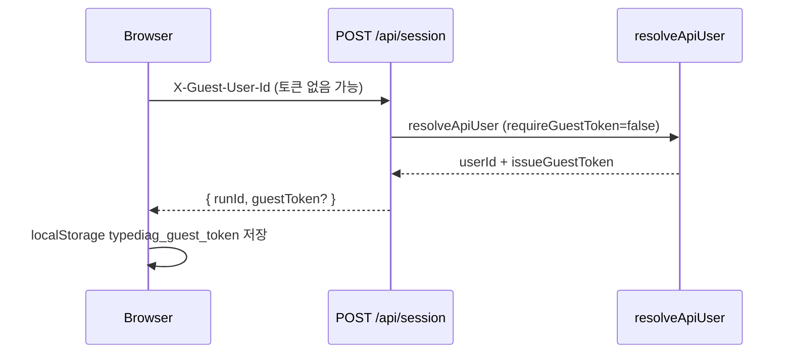

# 인증 및 게스트 사용자

TypeDiag는 **Clerk 로그인 사용자**와 **비로그인 게스트**를 모두 지원합니다. 두 경로 모두 `users.id`에 동일한 형식의 문자열 PK로 저장되며, 세션·키 이벤트 영속화 API는 공통 경로를 사용합니다.

| 사용자 유형 | `users.id` 형식 | 클라이언트 식별 |
| :--- | :--- | :--- |
| Clerk 로그인 | Clerk `userId` | Clerk 세션 쿠키 |
| 게스트 | `guest_<uuid>` | `localStorage` + API 헤더 |

정본 구현: `src/utils/guestUser.ts`, `src/utils/guestAuth.ts`, `src/lib/api/resolveApiUser.ts`

---

## 1. Clerk 로그인

- 패키지: `@clerk/nextjs`
- 서버 라우트는 `auth()`로 Clerk `userId`를 읽고, `db.getOrCreateUserByClerkId(clerkUserId)`로 DB 사용자를 확보합니다.
- 환경 변수: `.env.example`의 `NEXT_PUBLIC_CLERK_*`, `CLERK_SECRET_KEY` 참고.

---

## 2. 게스트 사용자

비로그인 상태에서도 타자 연습·세션 저장이 가능합니다.

### 2.1. 클라이언트 ID 발급

`getOrCreateGuestId()` (`src/utils/guestUser.ts`):

1. `localStorage` 키 `typediag_guest_id`에 기존 ID가 있으면 재사용
2. 없으면 `guest_${crypto.randomUUID()}` 생성 후 저장

### 2.2. HMAC 토큰

게스트 API 남용을 줄이기 위해 서버가 HMAC 토큰을 발급·검증합니다 (`src/utils/guestAuth.ts`).

- 헤더: `X-Guest-User-Id`, `X-Guest-Token`
- 서명: `HMAC-SHA256(guestId, GUEST_TOKEN_SECRET)` → base64url
- `GUEST_TOKEN_SECRET`: 프로덕션 필수, **16자 이상** (`.env.example` 참고)
- 개발/테스트: 시크릿 미설정 시 내장 fallback 사용 (프로덕션에서는 throw)

### 2.3. 토큰 Bootstrap 흐름

- **POST `/api/session`** (`start` / `finish` / `sync`): 토큰 없이도 허용. 유효하지 않거나 없는 토큰이면 응답에 `guestToken`을 포함해 bootstrap.
- **GET `/api/session?action=analysis`**: `requireGuestToken: true` — 유효한 `X-Guest-Token` 필수.

클라이언트는 `sessionServiceClient`가 모든 POST 응답에서 `applyGuestTokenFromResponse()`로 토큰을 자동 저장합니다.

### 2.4. API 헤더 헬퍼

| 함수 | 용도 |
| :--- | :--- |
| `getGuestAuthHeaders()` | 세션 API 등 — ID 없으면 새로 발급 |
| `getStoredGuestAuthHeaders()` | 로그인 머지용 — 기존 ID만, 새 ID 생성 안 함 |

---

## 3. 로그인 시 게스트 데이터 머지

`UserSyncEffect` (`src/components/auth/UserSyncEffect.tsx`)가 Clerk 로그인 직후 `POST /api/user/sync`를 호출합니다.

**조건** (모두 충족 시 머지):

1. Clerk 세션 유효 (`auth().userId` 존재)
2. `X-Guest-User-Id`가 `guest_` 접두사이며 Clerk ID와 다름
3. `X-Guest-Token`이 해당 guest ID에 대해 유효

머지 성공 시 `clearStoredGuestId()`로 localStorage의 게스트 ID·토큰을 제거합니다.  
서버는 `db.mergeGuestData(guestUserId, clerkUserId)`로 runs/pages 등을 이전합니다.

토큰 없이 로그인만 한 경우 머지는 수행되지 않습니다 (401).

---

## 4. 환경 변수 요약

| 변수 | 필수 | 설명 |
| :--- | :--- | :--- |
| `NEXT_PUBLIC_CLERK_PUBLISHABLE_KEY` | 프로덕션 | Clerk 공개 키 |
| `CLERK_SECRET_KEY` | 프로덕션 | Clerk 시크릿 |
| `GUEST_TOKEN_SECRET` | 프로덕션 | 게스트 HMAC 시크릿 (≥16자) |

---

## 5. 관련 문서

- API 계약: [API.md](API.md)
- DB `users` 테이블: [DB_SCHEMA.md](DB_SCHEMA.md)
- 세션 생명주기: [STATE_MANAGEMENT.md](STATE_MANAGEMENT.md)
