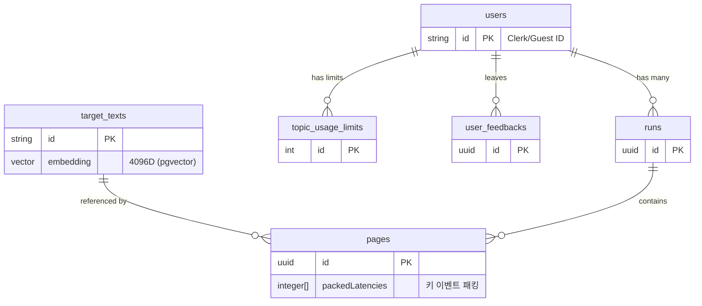

# 타이핑 진단 서비스 DB 스키마 설계

이 문서는 타이핑 진단 서비스에 사용되는 데이터베이스 구조를 설명합니다. 이 설계는 사용자 정보, 연습 세션, 개별 문장 결과를 기록하고 분석하는 데 초점을 맞춥니다.
최신 아키텍처에서는 **TimescaleDB, Drizzle ORM, Clerk 인증**을 사용합니다. 키 입력 이벤트는 별도 테이블 대신 `pages` 테이블의 **Parallel Array 컬럼**에 패킹되어 저장됩니다.

**네이밍 규칙 주의사항**: 데이터베이스 테이블 및 컬럼은 **snake_case**로 작성되며, TypeScript 코드 단의 Drizzle ORM 스키마 정의 (`src/db/schema.ts`)에서는 이를 **camelCase**로 자동 매핑합니다 (예: DB `created_at` ↔ TS `createdAt`).

---

## 테이블 관계 구조

---

## 테이블 상세 정의 (Drizzle ORM 기반)

### 1. users (사용자)

Clerk 인증과 연동되는 사용자 정보를 저장합니다.

- `id`: 사용자 고유 식별값 (VARCHAR(255), PK) — Clerk `userId` 또는 게스트 `guest_<uuid>`
- `created_at`: 생성 일시 (TimestampTZ, Not Null)
- `updated_at`: 수정 일시 (TimestampTZ, Not Null)

### 2. target_texts (제시문)

타자 연습을 위해 시스템에 등록되거나 실시간으로 생성된 원본 문장 데이터입니다. `pgvector`를 사용해 의미 기반 검색을 지원합니다.

- `id`: 고유 식별값 (VARCHAR(50), PK)
- `content`: 제시문 내용 (TEXT, Unique, Not Null)
- `language`: 문장의 언어 (VARCHAR(10), Not Null)
- `source`: 생성 출처 (VARCHAR(20), Not Null, Default 'default')
- `generator_model`: 생성 LLM 모델명 등 (VARCHAR(50), Nullable)
- `topic`: 유저가 입력한 주제어 (TEXT, Nullable)
- `user_id`: 등록한 사용자 식별값 (VARCHAR(255), FK, Nullable)
- `usage_count`: 완주 횟수 (INT, Not Null, Default 0)
- `last_used_at`: 최근 완주 일시 (TimestampTZ, Nullable)
- `embedding`: Upstage Solar Embedding API 벡터 (vector(4096), Nullable)
- `created_at`: 생성 일시 (TimestampTZ, Not Null)

### 3. runs (연습 세션)

사용자가 1회 연습을 시작해서 끝낼 때까지의 단위 기록입니다.

- `id`: 고유 식별값 (UUID, PK)
- `user_id`: 사용자 식별값 (VARCHAR(255), FK, Nullable)
- `status`: 진행 상태 ('pending', 'in_progress', 'completed') (VARCHAR(20), Not Null)
- `started_at`: 세션 시작 일시 (TimestampTZ, Not Null)
- `finished_at`: 세션 완료 일시 (TimestampTZ, Nullable)
- `cpm`: 세션 전체의 분당 타수 (Integer, Nullable)
- `wpm`: 세션 전체의 분당 단어 수 (Integer, Nullable)
- `accuracy`: 세션 전체의 정확도 퍼센트 (Real, Nullable)
- `created_at`: 생성 일시 (TimestampTZ, Not Null)

### 4. pages (문장 타이핑 결과)

한 세션 내에서 개별 문장을 타이핑한 결과 요약 정보를 저장합니다.

- `id`: 고유 식별값 (UUID, PK)
- `run_id`: 속한 세션 식별값 (UUID, FK, Not Null)
- `target_text_id`: 참조하는 제시문 식별값 (VARCHAR(50), FK)
- `order_index`: 세션 내 진행 순서 (Integer, Not Null)
- `language`: 문장 언어 구분 (VARCHAR(10), Not Null)
- `typed_text`: 사용자가 최종 입력한 문장 (TEXT, Not Null)
- `wpm`: 해당 문장의 분당 **단어** 수 (Integer, Not Null) — KO: 순수 한글 음절(가-힣) 수, EN: 공백 구분 토큰 수
- `cpm`: 해당 문장의 분당 **입력 단계** 수 (Integer, Not Null) — KO: `disassemble(targetText).length`, EN: `targetText.length`
- `accuracy`: 해당 문장의 정확도 퍼센트 (Real, Not Null)
- `started_at`: 문장 입력 시작 일시 (TimestampTZ, Not Null)
- `finished_at`: 문장 입력 완료 일시 (TimestampTZ, Not Null)
- `elapsed_time_ms`: 타이핑 소요 시간 밀리초 (Integer, Not Null)
- `created_at`: 생성 일시 (TimestampTZ, Not Null)
- `packed_from_keys`: 타건 순서대로 packed된 fromKey 배열 (varchar(20)[], Nullable — 이벤트 없으면 NULL)
- `packed_to_keys`: 타건 순서대로 packed된 toKey 배열 (varchar(20)[], Nullable)
- `packed_latencies`: fromKey→toKey 지연시간 ms 배열 (integer[], Nullable)
- `packed_holds`: 키 누름 지속시간 ms 배열, sentinel -1 = 기록없음 (integer[], Nullable)
- `packed_is_corrects`: 정타 여부 배열 (boolean[], Nullable)
- `packed_expected_chars`: 기대 정타 글자 배열, sentinel "" = 없음 (varchar(10)[], Nullable)
- `packed_key_chars`: 화면 출력 글자 배열, sentinel "" = 없음 (varchar(10)[], Nullable)

> [!NOTE]
> 인덱스 i는 i번째 타건에 대응. `unpackKeyEvents(page)` 함수(`src/db/queries/stats.ts`)가 7개 배열을 zip하여 `KeyEvent[]`로 복원.

### 5. topic_usage_limits (토픽 모드 사용량 제한)

API 검색 및 생성 호출을 추적하여 일일 한도를 제한합니다.

- `id`: 고유 식별값 (SERIAL, PK)
- `user_id`: 사용자 식별값 (VARCHAR(255), FK, Not Null)
- `ip_address`: 요청 IP 주소 (VARCHAR(45), Not Null)
- `action_type`: 제한 종류 (`'search'` \| `'generate'`) (VARCHAR(20), Not Null)
- `usage_date`: 사용 일자 (DATE, Not Null, Default Now)
- `request_count`: 해당 일자 요청 누적 수 (Integer, Not Null, Default 1)
- *유니크 제약조건(Unique Constraint): `(user_id, action_type, usage_date)`*

### 6. user_feedbacks (사용자 피드백)

워크스페이스 피드백 오버레이에서 전송된 의견을 저장합니다.

- `id`: 고유 식별값 (UUID, PK)
- `user_id`: 사용자 식별값 (VARCHAR(255), FK, Not Null)
- `message`: 피드백 본문 (TEXT, Not Null)
- `language`: UI 언어 (`ko` \| `en`) (VARCHAR(10), Not Null)
- `ip_address`: 요청 IP (VARCHAR(45), Nullable)
- `created_at`: 생성 일시 (TimestampTZ, Not Null)

---

## 주요 지표 계산 및 아키텍처

1. **실시간 처리 분리**: WPM/CPM/정확도는 `src/lib/practice/metrics.ts`의 `calculateMetrics()`로 페이지 완료 시 계산합니다. 타건 중에는 서버 통신이 없으며, 문장 완료 직후 1회 API 호출로 **`pages` 1행 (packed 배열 7개 포함) INSERT** 합니다.
2. **Parallel Array 패킹**: 키 입력 이벤트는 `pages` 테이블의 `packed_*` 컬럼에 배열로 내장됩니다. 기존 `key_events` Hypertable 방식 대비 디스크 사용량 ~90% 절감, 쓰기 RPS 대폭 감소.
3. **벡터 검색 (pgvector)**: Topic 모드 문장 검색 시 코사인 거리 연산자(`<=>`)로 `embedding` 컬럼을 DB 레벨에서 쿼리합니다.

---

## 연습 세션(Run) 생명주기 관리 로직

정본: `src/services/sessionService.ts`, `src/utils/db.ts` (`syncSessionOnMount`). 상세 규칙은 [STATE_MANAGEMENT.md](STATE_MANAGEMENT.md) §2 참고.

| 규칙 | 임계값 | 트리거 시점 | 동작 |
| :--- | :--- | :--- | :--- |
| **페이지 간 유휴** | 3분 | 새 문장 `startPage` | 이전 run `completed` 후 새 run 생성 |
| **문장 내 장시간 경과** | 5분 | `finishPage` | run 분리, page 시작 시각 보정 후 새 run에 저장 |
| **마운트 정리** | 3분 | `syncSessionOnMount` | 방치된 `in_progress` run 완료 처리 |
