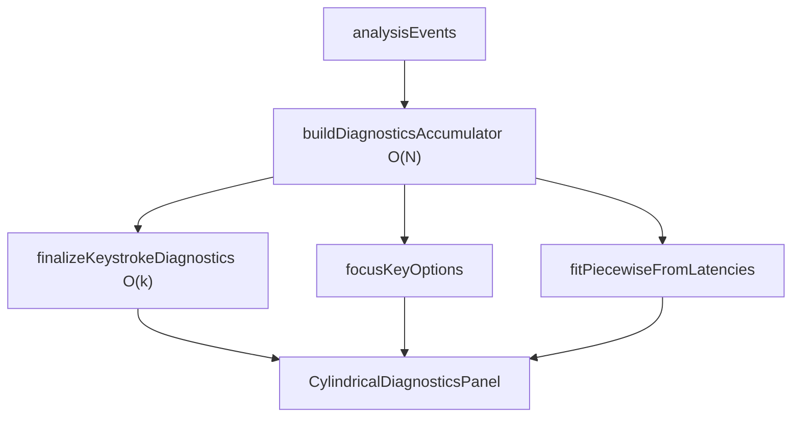
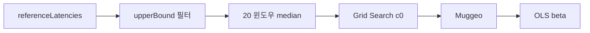
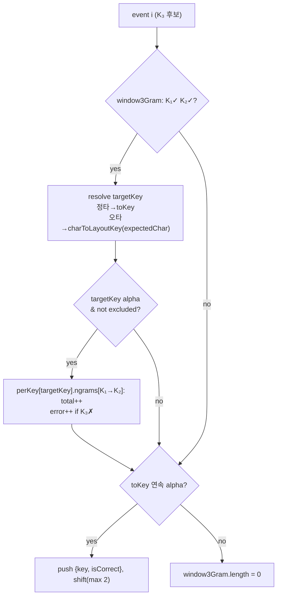

# TypeDiag: Cylindrical Diagnostics 명세

Cylindrical Vector 진단 드로어의 **구조·용어·데이터 흐름**과 주요 통계 알고리즘 명세입니다.

---

## 0. 아키텍처 (구조 SSOT)

### 이벤트 스트림과 전이 방향

`KeyEvent`는 시간순으로 `{ fromKey, toKey, latencyMs, holdDurationMs?, isCorrect?, expectedChar? }`를 기록합니다. **focusKey**를 중심으로 같은 스트림을 두 방향으로 읽습니다.

| 용어 | 식별 | 의미 | 대표 용도 |
| :--- | :--- | :--- | :--- |
| **focusKey** | `focusKey` | 진단·원통 3D의 분석 초점 키 | UI 선택값, 모든 집계 pivot |
| **reference transition** | `toKey === focusKey` | focusKey를 **누른** 행 | 분절회귀, MAD, hold(D), 원통 θ·r·z |
| **outgoing transition** | `fromKey === focusKey` | focusKey **다음** 행 | Cloud Typing(L), ND |

```
행 i-1   … → f   toKey=f     holdDurationMs=D   ← reference
행 i     f → …   fromKey=f   latencyMs=L        ← outgoing
```

hold(D)는 reference 행, latency(L)는 outgoing 행에서 읽습니다. 원통 3D(`buildCylindricalVectors`)는 reference만 사용 — [SKDM_ARCHITECTURE.md](SKDM_ARCHITECTURE.md) §5.

### 모듈 SSOT

| 계층 | SSOT |
| :--- | :--- |
| UI | `CylindricalDiagnosticsPanel.tsx` |
| 훅 | `useCylindricalDiagnostics.ts` |
| 1패스 누산 | `cylindricalStats.ts` — `buildDiagnosticsAccumulator` |
| focusKey 집계 | `finalizeKeystrokeDiagnostics`, `computeCloudTypingFromSamples` |
| 분절 회귀 | `piecewiseRegression.ts` — `fitPiecewiseFromLatencies` |
| 이상치 상한 | `piecewiseDev.ts` — `ensureFinalUpperBound` |
| dev 실험 | `cloudTypingDev.ts`, `/dev/cloud-typing/` |

### 데이터 흐름

`useCylindricalDiagnostics(events, focusKey)` — **events 변경 시만** O(N) 스캔, **focusKey 변경 시** accumulator 재사용.



**`DiagnosticsAccumulator`**: `correctByKey`, `pairCounts`, `keyStats`, `shiftLatencies`/`nonShiftLatencies`, `totalErrorStartsCount`, `perKey`.

**`PerKeyAccumulator`**: `referenceLatencies`, `fingerCounts`, `outgoingSamples`, `errorInducementCount`, `lateKeystrokeCount`, `spatialErrors`, `contextualTypos` (3-Gram 누산).

훅 반환: `focusKeyOptions`, `outcome`(분절회귀), `chartData`, `diagnostics`(`KeystrokeDiagnostics` — `fatalNgrams` 포함).

---

## 1. 지표 목록

UI는 3열 그리드 (`cylindrical-visualizer.css`). SSOT: `CylindricalDiagnosticsPanel.tsx`.

### Panel 1 · 키 진입 Dynamics

| 지표 | 요약 | 상세 |
| :--- | :--- | :--- |
| 모래시계 분절회귀 | reference latency 개선 추이·변곡점 | §2 |
| Latency 일관성 (MAD) | rMAD로 steady / moderate / erratic | reference `latencyConsistency` |
| 오타 유발율 | 이 키가 오타 스트릭을 시작한 비율 | `errorInducement` |
| 동일 손 손가락별 속도 | 같은 손 다른 손가락 대비 빠름/느림 | `relativeSpeed` |
| 손가락 전환 비율 | 직전 키 손가락 분포 | `fingerTransitions` |
| Shift 지연 패널티 | Shift vs 비-Shift 중앙값 차 | `shiftPenalty` (optional) |
| 무의식적 incorrect TopN | 오타율 높은 키 | `unconsciousKey` (optional) |

### Panel 2 · 타이밍 & 오타

| 지표 | 요약 | 상세 |
| :--- | :--- | :--- |
| Latency 중앙값 · CPM | reference 정타 기준 | `speedMetrics` |
| 머뭇거림 (IQR) | Q3+1.5×IQR 초과 비율, 5%↑ 경고 | `hesitation` |
| 순서 뒤바뀜 오타 | late keystroke 비율 | `lateKeystroke` |
| 자주 쓰는 순서쌍 TopN | 빈도 1위 쌍 | `commonPair` (optional) |

### Panel 3 · 공간 & 패턴

| 지표 | 요약 | 상세 |
| :--- | :--- | :--- |
| 공간적 오타 거리 | 정답↔실제 키 거리 Q1·Q2·Q3 궤도 | `spatialErrorDistance` |
| Dwell · Flight (구름타법) | 롤오버 %, dwell/flight 바, 효과성 r | §3 |
| N단계 전이 오타 패턴 | K₁✓ K₂✓ → focusKey, 오타율 >20%, 10회↑ | `fatalNgrams` (optional) · §4 |
| 버스트 쌍 | — | **미구현** |

신규 지표는 `buildDiagnosticsAccumulator` 루프에 수집 단계를 추가한 뒤 `finalizeKeystrokeDiagnostics`에서 소비합니다.

---

## 2. 분절 선형 회귀 (Piecewise Regression)

focusKey **reference transition** 정답 latency의 시간순 개선 추이를 두 연결 직선으로 피팅하고 **변곡점 c**를 탐지합니다.

$$y = \beta_0 + \beta_1 x + \beta_2 \max(0,\, x - c)$$

SSOT: `fitPiecewiseFromLatencies(referenceLatencies, focusKey, rawCorrectCount)` — accumulator가 모은 시퀀스를 입력합니다.

**파이프라인**

1. SKDM `finalUpperBound`로 이상치 제외 (레코드 없거나 유효 < 20건 → 중단)
2. 20개 균등 윈도우, 윈도우별 latency **중앙값** → 20점
3. Grid Search로 초기 $c_0$, Muggeo 수렴, 최종 OLS



---

## 3. Cloud Typing — 구름타법 (Dwell · Flight)

Panel 3 및 `/dev/cloud-typing`. focusKey **outgoing** 전이에서 롤오버(겹침) 타이밍을 측정합니다.

| 용어 | 정의 |
| :--- | :--- |
| **D** | reference `holdDurationMs` |
| **L** | outgoing `latencyMs` |
| **flight** | $\max(0, L - D)$ |
| **M** | ND 분모 하한, 기본 300ms (`CLOUD_TYPING_MIN_DENOM`) |
| **ND** | $\lvert L - D \rvert / \max(L + D, M)$ — 0에 가까울수록 구름 |
| **구름 stroke** | ND ≤ 0.25 |
| **분석 풀** | outgoing 원시 샘플 → 머뭇거림 IQR 통과분 |

**샘플 추출** (`extractOutgoingSamples`): outgoing 정답·`latencyMs>0`·제외키 없음 + 직전 행이 reference이고 hold 유효. reference `isCorrect`는 검사 안 함.

**IQR 필터**: outgoing latency 기준 $Q_3 + 1.5 \times \mathrm{IQR}$ 초과 제외.

**집계**: 분석 풀 n ≤ 10 → `insufficientSample`. 비율 → `level` (`not_applied` / `weak`≥0.7 / `moderate`≥0.8 / `strong`≥0.9). ND↔L Pearson r → `effectiveness` (|r|>0.3, p<0.05, n≥5).

SSOT: 집계 `cylindricalStats.ts`, dev 산점도 `cloudTypingDev.ts`. 테스트: `cloudTyping.test.ts`, `cloudTypingDev.test.ts`.

**제한**: 마지막 키 hold 미기록 시 샘플 누락. IQR로 풀 n 감소 가능. $D>L$ 가능(ND는 절댓값).

---

## 4. Contextual 3-Gram — 치명적 오타 맥락

Panel 3 **「치명적 3-Gram 오타 맥락」**. `finalizeKeystrokeDiagnostics`가 선택한 **focusKey**를 K₃로 두고, **연속 알파 스트림**에서 K₁·K₂가 모두 정타인 직후에 focusKey를 시도한 횟수·오타율을 집계합니다.

### 한 줄 정의

> **K₁(정타) → K₂(정타) → K₃(focusKey)** 연속 알파 3타마다 `total` +1. K₃ 오타면 `error` +1.

인접 3-gram만 셉니다. 이벤트 전체에서 임의의 (i, j, k) 삼중 조합을 열거하지 않습니다.

### 용어

| 용어 | 정의 |
| :--- | :--- |
| **3-Gram 패턴** | `[K₁, K₂, focusKey]` — K₁·K₂ 정타 뒤 focusKey 시도 |
| **K₁, K₂** | `window3Gram`에 쌓인 **직전 2연속 알파 `toKey`**. 각각 `isCorrect === true` 여야 집계 |
| **K₃** | 현재 이벤트. 누산 시 `targetKey`로 해석 — 정타면 `toKey`, 오타면 `charToLayoutKey(expectedChar)` |
| **focusKey** | UI·`finalizeKeystrokeDiagnostics` pivot. K₃의 `targetKey`와 같을 때만 해당 키의 `ngrams` Map에서 조회 |
| **total** | K₃ **정타 + 오타** 모두 (focusKey 시도 1회) |
| **error** | K₃ `isCorrect === false` 만 |
| **오타율** | `error / total × 100` |
| **치명적 맥락** | `total ≥ FATAL_NGRAM_MIN_SAMPLES` **그리고** `오타율 > FATAL_NGRAM_ERROR_RATE_THRESHOLD` |

### 복잡도

| 단계 | 시간 | 설명 |
| :--- | :--- | :--- |
| `buildDiagnosticsAccumulator` §10 | **O(N)** | events 1회 순회. `window3Gram` 길이 ≤ 2, 이벤트당 Map get/set 1회 |
| `selectFatalNgrams` | **O(k log k)** | k = focusKey에 등장한 distinct `K₁→K₂` 패턴 수 (키보드 알파 조합 상한 ≪ N) |
| 전체 | **O(N + k log k) ≈ O(N)** | O(N²)가 아님 — 과거 이벤트 쌍·삼중을 재탐색하지 않음 |

1패스 누산 중 **모든** `targetKey`에 대해 `perKey[targetKey].contextualTypos.ngrams`를 갱신합니다. `focusKey` 변경 시 events 재순회 없이 `perKey.get(focusKey)`만 읽습니다 (`useCylindricalDiagnostics`).

### 수집 알고리즘 (`buildDiagnosticsAccumulator` §10)

전역 `window3Gram: { key, isCorrect }[]` (최대 길이 2)를 유지합니다.

**이벤트당 처리 순서** (코드 순서와 동일):

1. 현재 이벤트를 K₃로 보고, `window3Gram`의 K₁·K₂로 집계 (윈도우 갱신 **전**)
2. 현재 이벤트 `toKey`로 `window3Gram` push 또는 clear



**K₃ `targetKey`**

- `isCorrect === true` → `toKey`
- `isCorrect === false` + `expectedChar` → `charToLayoutKey(expectedChar)`
- 오타인데 `expectedChar` 없음 → 집계 안 함
- `targetKey`가 `[a-zA-Z]`가 아니거나 제외키 → 집계 안 함

**맥락 조건**

1. `window3Gram.length ≥ 2`, K₁·K₂ 모두 `isCorrect === true`
2. K₁→K₂→K₃ 사이에 비알파·제외 `toKey`가 없음 (연속 알파 스트림만 윈도우에 유지)

**window 갱신** (집계 직후, 동일 이벤트)

| 현재 `toKey` | 동작 |
| :--- | :--- |
| `[a-zA-Z]` 이고 `ACCUMULATOR_EXCLUDE_KEYS` 아님 | `{ key: toKey, isCorrect: isCorrect===true }` push, 길이 > 2면 shift |
| 그 외 (space, backspace, enter, shift 등) | `window3Gram.length = 0` |

제외키 (`ACCUMULATOR_EXCLUDE_KEYS`): `shift_l`, `shift_r`, `backspace`, `enter`.

`backspace`·`enter`는 윈도우만 끊고, 그 이전에 이미 누적된 ngram 통계는 되돌리지 않습니다.

### 예시 (focusKey = `k`)

| 시퀀스 | `perKey[k].ngrams` | 비고 |
| :--- | :--- | :--- |
| `s✓ → d✓ → k✓` | `s→d`: total +1 | |
| `s✓ → d✓ → k✗ (expected k)` | `s→d`: total +1, error +1 | 오타도 `targetKey=k`로 귀속 |
| `s✗ → d✓ → k✗` | — | K₁ 오타 → 윈도우에 isCorrect=false, 집계 스킵 |
| `s✓ → d✗ → k✗` | — | K₂ 오타 → 동일 |
| `s✓ → d✓ → space → k✗` | — | space가 윈도우 초기화 |
| `s✓ → d✓ → f✓ → backspace → s✓ → d✓ → k✗` | `s→d`: total +1, error +1 | backspace 이후 맥락은 새 3-gram |

### focusKey 집계 (`finalizeKeystrokeDiagnostics`)

`KeystrokeDiagnostics.fatalNgrams` ← `perKey.get(focusKey).contextualTypos.ngrams`.

Map 키: `K₁→K₂` (문자열). 값: `{ total, error }`.

`selectFatalNgrams(ngrams, focusKey)` (export, 단위 테스트 가능):

1. `total >= FATAL_NGRAM_MIN_SAMPLES` (10)
2. `errorRate > FATAL_NGRAM_ERROR_RATE_THRESHOLD` (20%) — **초과**, 20.0% 정확히는 제외
3. 오타율 내림차순 → 동률이면 `total` 내림차순
4. `{ sequence: [K₁, K₂, focusKey], errorRate, totalCount }[]` — **조건 통과 패턴 전부** (상위 1개만 아님)

### UI (`CylindricalDiagnosticsPanel`)

- `diagnostics.fatalNgrams.length > 0`일 때만 카드 렌더 (미달 시 Panel 3에서 숨김)
- 각 패턴: `FatalNgramViz` — K₁→K₂→focusKey 키캡, 오타율, 총 진입 횟수
- 카드 하단 설명에 `FATAL_NGRAM_ERROR_RATE_THRESHOLD`, `FATAL_NGRAM_MIN_SAMPLES` 상수 표기

SSOT: `cylindricalStats.ts` (`FatalNgramEntry`, `buildDiagnosticsAccumulator` §10, `selectFatalNgrams`). 테스트: `fatalNgram.test.ts`.

---

## 부록 · 상수

| 상수 | 값 |
| :--- | :--- |
| `CLOUD_TYPING_MIN_DENOM` | 300 |
| `CLOUD_TYPING_ND_MAX` | 0.25 |
| `CLOUD_TYPING_MIN_SAMPLES` | 10 |
| `CLOUD_TYPING_LEVEL_WEAK` / `MODERATE` / `STRONG` | 0.7 / 0.8 / 0.9 |
| `FATAL_NGRAM_MIN_SAMPLES` | 10 |
| `FATAL_NGRAM_ERROR_RATE_THRESHOLD` | 20 (%) |
| `CLOUD_TYPING_CORRELATION_R_THRESHOLD` | 0.3 |
| `CLOUD_TYPING_CORRELATION_P_THRESHOLD` | 0.05 |
| `CLOUD_TYPING_CORRELATION_MIN_SAMPLES` | 5 |
| `LATENCY_CONSISTENCY_MIN_SAMPLES` | 5 |
