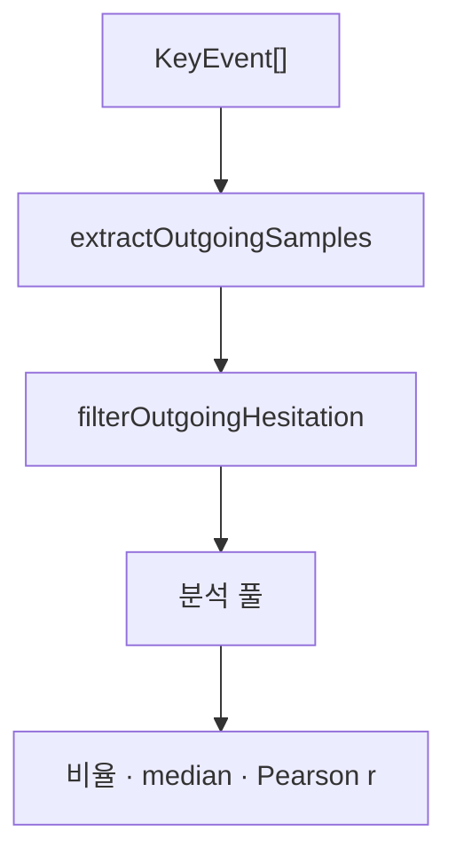

# TypeDiag: 지연 진단 통계 & Piecewise Regression 명세서

이 문서는 **TypeDiag**에서 사용자의 타건 개선 추이를 파악하기 위해 사용하는 핵심 통계 알고리즘인 **분절 선형 회귀 (Piecewise Linear Regression)**의 동작 방식과 수학적/기술적 로직을 정리한 명세서입니다.

### Cylindrical Diagnostics 용어 (SSOT)

| 용어 | 코드 | 필터 |
| :--- | :--- | :--- |
| **focusKey** | `focusKey` | 진단 패널에서 사용자가 선택한 분석 초점 키 |
| **reference transition** (기준 쌍) | — | `toKey === focusKey` |
| **outgoing transition** | — | `fromKey === focusKey` |

UI SSOT: `src/components/workspace/CylindricalDiagnosticsPanel.tsx` · 통계 SSOT: `src/utils/cylindricalStats.ts` · 훅: `src/hooks/useCylindricalDiagnostics.ts`

---

## 1. 2D Piecewise Linear Regression (분절 선형 회귀)

사용자가 특정 키를 반복 연습함에 따라 지연 시간(latencyMs)이 개선되는 양상을 두 개의 연결된 직선으로 피팅하는 수학적 회귀 모델입니다. 

기존의 단순 선형 회귀와 달리, **"사용자가 연습을 통해 정체기를 극복하거나 급격히 속도가 개선되는 특정 변곡점(Breakpoint)"**을 수학적으로 탐지하는 데 목적이 있습니다.

```
지연 시간 (latencyMs)
  ▲
  │   \ (기울기: β1)
  │    \
  │     \
  │──────*────────────── (변곡점 c)
  │       \ (기울기: β1 + β2)
  │        \────────────────
  └──────────────────────────► 시간 순서 (Index)
```

### 1.1. 수학적 모델 방정식
$$y = \beta_0 + \beta_1 x + \beta_2 \max(0, \, x - c)$$
*   **$x \le c$ (분절점 이전)**: $y = \beta_0 + \beta_1 x$
*   **$x > c$ (분절점 이후)**: $y = (\beta_0 - \beta_2 c) + (\beta_1 + \beta_2) x$
    *   $\beta_0$: 절편 (Intercept)
    *   $\beta_1$: 분절 이전의 기울기 (Slope Before)
    *   $\beta_2$: 분절 전후의 기울기 변화량 (Slope Difference)
    *   $\beta_1 + \beta_2$: 분절 이후의 최종 기울기 (Slope After)
    *   $c$: 분절점 (Breakpoint, 개선 변곡점)

---

### 1.2. 단계별 알고리즘 및 코드 로직

전체 연산 흐름은 `src/utils/piecewiseRegression.ts` 의 `fitPiecewiseLinearWithDiagnostics` 함수를 통해 가동됩니다.


#### 1.1단계. 데이터 필터링 및 윈도잉 (`aggregateToWindows`)
1.  **이상치 차단**: focusKey(`toKey === focusKey` reference transition)의 정타 이벤트 중 `latencyMs`가 0보다 크고 이상치 상한 임계값(`upperBoundMs`) 이하인 유효 데이터만 추립니다. (유효 데이터가 20개 미만일 시 연산 중단)
2.  **구간별 중앙값 집계**: 노이즈를 제어하기 위해 유효 데이터를 시간순으로 정렬한 후 **20개의 균등 윈도우**로 분할합니다.
3.  **대표 점 도출**:
    *   **$X$ 좌표**: 각 윈도우 구간의 중간 인덱스 (인덱스 스케일 보존)
    *   **$Y$ 좌표**: 각 윈도우 구간 내의 `latencyMs` 중앙값 (Median)
    *   이를 통해 최종 20개의 가공된 대표 데이터 포인트 $(x_i, y_i)$ 가 준비됩니다.

#### 1.2단계. 그리드 서치 (`gridSearchC0`)
변곡점 $c$가 위치할 수 있는 최적의 초기 후보값 $c_0$를 선정합니다.
*   데이터 양 끝단 10% 영역을 제외한 나머지 범위 내에서, 후보 $c$를 대입하여 OLS(최소제곱법)로 직선을 피팅하고 **오차제곱합(RSS, Residual Sum of Squares)**을 전수 조사합니다.
*   RSS가 가장 작게 나타나는 지점의 $X$ 값을 초기 분절점 $c_0$로 확정합니다.

#### 1.3단계. 무제오 알고리즘 (`muggeoMethod`)
그리드 서치로 얻은 $c_0$를 무제오 알고리즘(Muggeo's Method, 2003)을 통해 소수점 이하 단위까지 정밀 수렴시킵니다.
1.  **4열 설계 행렬 구성**:
    $$\mathbf{X}_{\text{design}} = \begin{bmatrix} 1 & x_i & \max(0, x_i - c) & I(x_i > c) \end{bmatrix}$$
    *   $I(x_i > c)$는 $x_i$가 $c$보다 크면 1, 아니면 0인 지시 함수(Indicator Function) 열입니다.
2.  **OLS 해 계산**:
    $$\boldsymbol{\beta} = (\mathbf{X}^T \mathbf{X})^{-1} \mathbf{X}^T \mathbf{y}$$
    *   가우스-조르당 소거법을 사용해 수치적으로 역행렬을 계산하여 $\boldsymbol{\beta} = \begin{bmatrix} \beta_0 & \beta_1 & \beta_2 & \beta_3 \end{bmatrix}^T$를 도출합니다.
3.  **분절점 업데이트**:
    $\beta_3$(지시 함수 계수) 값을 $\beta_2$(기울기 변화량)로 나누어 분절점 $c$의 수정 방향과 크기를 구합니다.
    $$c_{\text{new}} = c - \frac{\beta_3}{\beta_2}$$
4.  **수렴 루프**:
    이 과정을 업데이트 격차가 $10^{-6}$ 이하가 되거나 최대 50회 도달할 때까지 반복하여 수렴된 최종 $c$를 얻습니다.

#### 1.4단계. 최종 OLS 적합 및 방정식 산출
1.  수렴된 최종 분절점 $c$를 기준으로 3열 설계 행렬 $\mathbf{X}_{\text{design}} = \begin{bmatrix} 1 & x_i & \max(0, x_i - c) \end{bmatrix}$을 빌드합니다.
2.  최종 OLS를 수행하여 계수 $\beta_0, \beta_1, \beta_2$를 계산하고 예측 함수 `predict(x)`를 반환합니다.

---

## 2. 기타 진단 통계 지표 (요약)

| 지표명 | 측정 목적 및 로직 요약 |
| :--- | :--- |
| **Cloud Typing (Dwell · Flight)** | 선택 키 **outgoing** 전이 집계 — 롤오버(구름타법) 비율·dwell/flight·효과성 상관. 상세: **§2.1**. |
| **Hesitation Ratio** | 사분위수 기준 이상치 한계선($Q_3 + 1.5 \times \text{IQR}$)보다 현저히 늦게 입력된 타건 비율을 집계 (5% 이상 시 머뭇거림 의심). |
| **Late Keystroke** | 타이핑이 빠를 때 발생하는 오타 유형으로, 떼는 타이밍 누수로 인해 뒤의 키가 먼저 입력되는 현상을 감지. |
| **Error Inducement** | 오타 스트릭이 시작된 최초 입력 시점들 중, 현재 키를 입력하려다가 스트릭이 깨진 오타 시작 기여도를 측정. |
| **Shift Overhead** | Shift 조합 글자(ㅃ, ㅉ, ㄸ 등) 입력 시 단독 입력 대비 추가로 지연되는 평균 패널티 및 좌/우 Shift 편향 분석. |
| **Finger Transitions** | 대상 키 바로 직전에 입력된 이전 키의 손가락 위치 분포를 분석하여 특정 이동 경로상의 병목 트래킹. |

---

## 2.1. Cloud Typing — 구름타법 (Dwell · Flight)

Cylindrical Diagnostics **Panel 3** 및 `/dev/cloud-typing` 실험 페이지의 지표입니다.

| 역할 | SSOT |
| :--- | :--- |
| **ND·집계·산점도** | `src/lib/dev/cloudTypingDev.ts` |
| **샘플 추출·IQR·타입** | `src/utils/cylindricalStats.ts` |
| **진단 패널 UI** | `CylindricalDiagnosticsPanel` (`CloudTypingView`) |
| **실험 UI** | `DevCloudTypingPanel`, `DevCloudTypingScatterChart` |
| **테스트** | `cloudTypingDev.test.ts`, `cloudTyping.test.ts` |

### 2.1.1. 진단 목적

키 릴리즈·롤오버(겹침) 타이밍을 측정합니다.

- **focusKey**를 고르면, 그 키를 **누른 뒤 다음 키로 넘어갈 때** 얼마나 겹쳐 잡는지 정량화합니다.
- **비율(%)**: 분석 풀에서 구름 stroke 비율 → `level`.
- **효과성(r)**: ND와 latency(L)의 피어슨 상관.

### 2.1.2. 용어

| 용어 | 정의 |
| :--- | :--- |
| **reference transition** | `toKey === focusKey` — focusKey를 **누른** 행. **D(hold)** 출처. |
| **outgoing transition** | `fromKey === focusKey` — focusKey **다음** 행. **L(latency)** 출처. |
| **D** | reference 행 `holdDurationMs`. |
| **L** | outgoing 행 `latencyMs` (IKI). |
| **flight** | $\max(0,\; L - D)$ |
| **M** | ND 분모 하한(ms). 기본 **300** (`CLOUD_TYPING_MIN_DENOM`). 휴리스틱 — 빠른 타건에서 ND가 0·1로 폭주하는 것을 완화. dev UI 슬라이더로 조절 가능. |
| **ND** | $\lvert L - D \rvert / \max(L + D,\; M)$. **0에 가까울수록 구름**. |
| **구름 stroke** | $\mathrm{ND} \le 0.25$ |
| **cloudTypingRatio** | 분석 풀 중 stroke 비율 (0~1) |
| **level** | `not_applied` / `weak` / `moderate` / `strong` |
| **분석 풀** | 원시 outgoing에서 머뭇거림 IQR 통과한 샘플 |

hold는 reference 행, latency는 outgoing 행에서 읽습니다. focusKey outgoing 전체를 **한 풀**에 합산합니다.

```
행1  a → f   toKey=f  holdDurationMs=120   ← reference
행2  f → j   fromKey=f  latencyMs=70       ← outgoing
```

### 2.1.3. 샘플 추출



**원시 샘플 조건** (`extractOutgoingSamples`):

1. outgoing: `fromKey === focusKey`, `isCorrect`, `latencyMs > 0`, `toKey` ∉ `{shift_l, shift_r, backspace, enter}`
2. reference: `toKey === focusKey`, `holdDurationMs` 유효
3. reference `isCorrect`는 **검사 안 함**

**머뭇거림 IQR** (`filterOutgoingHesitation`):

$$\text{threshold} = Q_3 + 1.5 \times (Q_3 - Q_1)$$

`latencyMs > threshold` 샘플 제외. 사분위수는 **원시 outgoing latency** 기준.

### 2.1.4. 수학 모델

$$D = \text{hold},\qquad \text{flight} = \max(0,\; L - D)$$

$$\mathrm{ND} = \frac{\lvert L - D \rvert}{\max(L + D,\; M)}$$

**stroke:** $\mathrm{ND} \le 0.25$

| 구간 | 조건 | stroke 조건 |
| :--- | :--- | :--- |
| 절대 | $L + D \le M$ | $\lvert L - D \rvert \le 0.25M$ (300 ms일 때 75 ms) |
| 비율 | $L + D > M$ | $\lvert L - D \rvert / (L+D) \le 0.25$ |

예시 ($M=300$):

| D | L | ND | stroke? |
| :---: | :---: | :---: | :---: |
| 40 | 20 | 20/300 ≈ 0.07 | ✅ |
| 10 | 100 | 90/300 = 0.30 | ❌ |
| 80 | 120 | 40/200 = 0.20 | ✅ |
| 60 | 140 | 80/200 = 0.40 | ❌ |
| 100 | 80 | 20/180 ≈ 0.11 | ✅ |

**구름 밴드** (D–L 산점도): `computeDevCloudBandLatencies`가 hold=$D$일 때 stroke latency 범위를 계산하고, `traceDevCloudBandPolygon`이 폴리곤으로 그립니다. $D=L$ 대각선은 겹침 없음 참고선.

### 2.1.5. 집계 · 분류

`computeCloudTypingDiagnostics` / `buildCloudTypingDevData` 공통 흐름:

1. `extractOutgoingSamples` → `filterOutgoingHesitation`
2. 분석 풀 0건 → `key: null`
3. 분석 풀 $n \le 10$ → `insufficientSample: true`, `key: null`
4. ND·stroke·비율·median·Pearson r 산출

**level** (비율만):

| `cloudTypingRatio` | `level` |
| :--- | :--- |
| `< 0.7` | `not_applied` |
| `≥ 0.7` | `weak` |
| `≥ 0.8` | `moderate` |
| `≥ 0.9` | `strong` |

**effectiveness** ($|r| > 0.3$, $p < 0.05$, $n \ge 5$):

| 조건 | `effectiveness` |
| :--- | :--- |
| $r \le -0.3$ | `effective` — 빠를수록 구름↑ |
| $r \ge +0.3$ | `counterproductive` — 겹치려다 느려짐 |
| 그 외 | `neutral` / 비유의 시 «상관 무의미» |

### 2.1.6. UI 매핑

| UI | 필드 |
| :--- | :--- |
| `NN% · 약함/…` | `cloudTypingRatio`, `level` |
| 효과성 라벨 | `effectiveness` |
| 나가는 전이 n | `key.sampleCount` (분석 풀) |
| Latency·Dwell 막대 | `latencyMs`, `dwellMs` median |
| 표본 부족 | `insufficientSample` |
| dev: 원시 n / 풀 n / 제외 수 | `rawOutgoingCount`, `analysisPoolCount`, `excludedPoints` |
| dev: M 슬라이더 | `minDenomMs` (기본 300 ms) |
| dev: D vs L 산점도 | `analysisPoints`, `excludedPoints`, 구름 밴드 |

### 2.1.7. 상수

| 상수 | 값 | 용도 |
| :--- | :--- | :--- |
| `CLOUD_TYPING_MIN_DENOM` | `300` | ND 분모 하한 $M$ (휴리스틱) |
| `CLOUD_TYPING_ND_MAX` | `0.25` | stroke 상한 |
| `CLOUD_TYPING_MIN_SAMPLES` | `10` | 이하 → `insufficientSample` |
| `CLOUD_TYPING_LEVEL_WEAK` | `0.7` | |
| `CLOUD_TYPING_LEVEL_MODERATE` | `0.8` | |
| `CLOUD_TYPING_LEVEL_STRONG` | `0.9` | |
| `CLOUD_TYPING_CORRELATION_R_THRESHOLD` | `0.3` | |
| `CLOUD_TYPING_CORRELATION_P_THRESHOLD` | `0.05` | |
| `CLOUD_TYPING_CORRELATION_MIN_SAMPLES` | `5` | |

`CLOUD_TYPING_DEV_MIN_DENOM`·`CLOUD_TYPING_DEV_ND_MAX`는 dev UI 별칭(동일 값).

### 2.1.8. 알려진 제한

- 마지막 키 hold 미기록 시 outgoing 샘플 누락.
- IQR로 분석 풀 n이 원시 outgoing n보다 작아질 수 있음.
- $D > L$ 가능 — ND는 절댓값으로 처리.
- Dwell 막대 표시 시 median $D >$ median $L$이면 100% 초과 가능.

---

## 3. Cylindrical Diagnostics 패널 구성 (3-Panel)

Cylindrical Vector 진단 드로어는 동일 너비 3열 그리드로 구성합니다.  
UI SSOT: `src/components/workspace/CylindricalDiagnosticsPanel.tsx`  
스타일: `src/app/styles/cylindrical-visualizer.css`

### Panel 1 · 키 진입 Dynamics

| 지표 | 비고 |
| :--- | :--- |
| 모래시계 분절회귀 | §1 Piecewise Regression |
| Latency 분포 · 일관성 (MAD) | 오락가락 vs 일정 — `latencyConsistency` (MAD, rMAD, 히스토그램) |
| 오타 유발율 | 전체 키 중 처음 오타를 유발한 비율 |
| 동일 손 손가락별 속도 비교 | 같은 손 다른 손가락 대비 빠름/느림 |
| 어느 손가락에서 넘어오는지 | 직전 키 손가락 전환 비율 |
| 무의식적 incorrect 키 TopN | optional |
| Shift 지연 패널티 | optional — 시프트 때문에 느려지는 키 |

### Panel 2 · 타이밍 & 오타

| 지표 | 비고 |
| :--- | :--- |
| Latency 중앙값 · CPM | focusKey reference transition 정타 기준 |
| IQR 기반 머뭇거림 | Q3 + 1.5×IQR 초과 비율 |
| 순서 뒤바뀜 오타율 | 오타 쌍 중 이 키를 늦게 눌러 순서가 바뀐 비율 |
| 자주 쓰는 순서쌍 TopN | optional |

### Panel 3 · 공간 & 패턴

| 지표 | 비고 |
| :--- | :--- |
| 공간적 오타 거리 | `expectedChar === focusKey && isCorrect === false` — reference transition 정답↔실제 `toKey` 거리 Q1·Q2·Q3 궤도 시각화 |
| Dwell · Flight (구름타법) | §2.1 — outgoing transition 집계, $\lvert\mathrm{ND}\rvert\le 0.25$ 롤오버 %, dwell/flight 바, 효과성 r |
| N단계 전이 오타 패턴 | optional — **미구현** |
| 버스트 쌍 포함 여부 | optional — **미구현** |

---

## 4. 진단 통계 계산 리팩터링 (Planned)

### 4.1. 배경 · 문제

현재 `useCylindricalDiagnostics`는 `events` 배열에 대해 **독립적인 `useMemo` 블록**으로 계산합니다.

| 블록 | SSOT | 스캔 범위 |
| :--- | :--- | :--- |
| `focusKeyOptions` | `countCorrectReferenceTransitions` | O(N) |
| 분절회귀 | `fitPiecewiseLinearWithDiagnostics` | O(N) 필터 + 고정 20윈도우 회귀 |
| Keystroke 통계 | `calculateKeystrokeDiagnostics` | O(N) 다중 패스 + `.filter()` 할당 |

`calculateKeystrokeDiagnostics`(`src/utils/cylindricalStats.ts`)는 동일한 `events`를 **5~7회** 순회하며, `events.filter(...)`로 **중간 배열을 3개 이상** 생성합니다.  
분절회귀도 `toKey === focusKey`(reference transition) && `isCorrect` 조건으로 **별도 필터**를 수행합니다.

Run 단위 `analysisEvents`(수천~수만 건)에서는 체감 지연이 없으나, 통계 항목이 늘거나 데이터 범위가 커지면 **O(통계수 × N)** 및 **GC 할당**이 누적됩니다.

### 4.2. 원칙 — 스캔은 합치고, 알고리즘은 분리

| 계층 | 합침 여부 | SSOT 유지 |
| :--- | :--- | :--- |
| **이벤트 1패스 수집 (Accumulator)** | ✅ 합침 | 신규 `buildDiagnosticsAccumulator` (예정) |
| **분절회귀 연산** (Grid Search, Muggeo, OLS) | ❌ 분리 | `src/utils/piecewiseRegression.ts` |
| **Keystroke 집계·비율·상관** | ❌ 분리 (입력만 공유) | `src/utils/cylindricalStats.ts` |
| **SKDM upperBound** (`ensureFinalUpperBound`) | ❌ 분리 | `src/lib/dev/piecewiseDev.ts` — 진단 진입 시 1회 |

분절회귀 **수학 모듈을 cylindricalStats에 합치지 않습니다.** 패리티 테스트(`piecewiseRegression.test.ts`)와 Muggeo/OLS SSOT를 보존합니다.

### 4.3. 목표 아키텍처


**1패스 Accumulator가 모으는 것 (예정)**

- **전역**: `focusKeyOptions`, 순서쌍 빈도, 키별 correct/incorrect, 오타 유발·순서 뒤바뀜 카운트
- **focusKey 전용** (순서 유지): reference transition 정답, latency 시퀀스, holdDuration 쌍, 손가락 전환, 동일 손 타 키 latency

**분절회귀 입력 경로 (예정)**

```ts
// 현재: events 전체를 다시 필터 (reference transition)
fitPiecewiseLinearWithDiagnostics(events, focusKey)

// 리팩터 후: 수집된 시퀀스만 전달 (내부 20윈도우·회귀 동일)
fitPiecewiseFromLatencies(orderedLatencies, { focusKey, upperBoundMs })
```

기존 `fitPiecewiseLinearWithDiagnostics(events, …)` 시그니처는 **얇은 래퍼**로 유지해 호출부 호환을 보장할 수 있습니다.

### 4.4. 합쳐도 줄지 않는 비용

단일 패스로 전환해도 아래는 그대로입니다.

- 선택 키 정답 latency에 대한 **median / IQR 정렬** — O(k log k)
- 분절회귀 **20윈도우 이후 회귀** — O(1)에 가까움
- `ensureFinalUpperBound` → SKDM `runPipeline` — 진단 진입 시 별도 1회

리팩터링의 실질 이득은 **CPU k배 가속**보다 **중복 filter·중간 배열 제거** 및 **신규 통계 추가 시 N 스캔 증가 방지**에 있습니다.

### 4.5. 미구현 통계 구현 시 가이드

§3 Panel 1~3의 **미구현** 항목은 구현 시 아래를 따릅니다.

| 지표 | 권장 방식 |
| :--- | :--- |
| Latency 분포 (MAD) | `computeLatencyConsistency` — focusKey reference transition 정답 latency에 MAD/rMAD, 5건 미만 시 null |
| 공간적 오타 거리 | `getSpatialErrorDistance` — 오타 이벤트 스캔, `buildLayout` 좌표 lookup |
| Dwell · Flight | §2.1 — `extractOutgoingSamples`, `buildCloudTypingDevData` / `computeCloudTypingDiagnostics` |
| N단계 전이 패턴 | 최근 N건 또는 고정 윈도우 (예: 2,000건) |
| 버스트 쌍 | latency 임계값 기반 연속 구간 탐지 — 윈도우 스캔 |

전체 히스토리(수십만 건 이상) 기준 진단이 필요해지면 **서버 pre-aggregate**(DB 집계) 또는 **Web Worker** 분리를 별도 검토합니다. Run 단위 MVP에서는 §4.3 accumulator 리팩터만으로 충분합니다.

### 4.6. 작업 체크리스트 (예정)

- [ ] `DiagnosticsAccumulator` 타입 및 `buildDiagnosticsAccumulator(events)` 구현
- [ ] `calculateKeystrokeDiagnostics` → accumulator 소비형 `finalizeKeystrokeDiagnostics`로 전환
- [ ] `fitPiecewiseFromLatencies` (또는 collected events 입력) 추가, 기존 API 래퍼 유지
- [ ] `useCylindricalDiagnostics`에서 단일 accumulator 생성 후 분기
- [ ] 기존 `useCylindricalDiagnostics.test.ts` · `cylindricalStats` · `piecewiseRegression` 테스트 통과
- [ ] §3 미구현 통계를 accumulator 확장 포인트에 순차 추가
