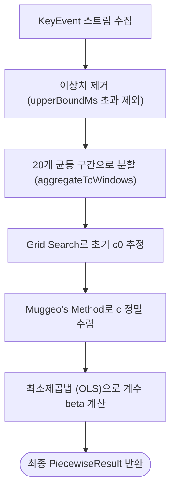

# TypeDiag: 지연 진단 통계 & Piecewise Regression 명세서

이 문서는 **TypeDiag**에서 사용자의 타건 개선 추이를 파악하기 위해 사용하는 핵심 통계 알고리즘인 **분절 선형 회귀 (Piecewise Linear Regression)**의 동작 방식과 수학적/기술적 로직을 정리한 명세서입니다.

---

## 1. 2D Piecewise Linear Regression (분절 선형 회귀)

사용자가 특정 키를 반복 연습함에 따라 지연 시간(latencyMs)이 개선되는 양상을 두 개의 연결된 직선으로 피팅하는 수학적 회귀 모델입니다. 

기존의 단순 선형 회귀와 달리, **"사용자가 연습을 통해 정체기를 극복하거나 급격히 속도가 개선되는 특정 변곡점(Breakpoint)"**을 수학적으로 탐지하는 데 목적이 있습니다.

```
지연 시간 (latencyMs)
  ▲
  │   \ (기울기: β1)
  │    \
  │     \
  │──────*────────────── (변곡점 c)
  │       \ (기울기: β1 + β2)
  │        \────────────────
  └──────────────────────────► 시간 순서 (Index)
```

### 1.1. 수학적 모델 방정식
$$y = \beta_0 + \beta_1 x + \beta_2 \max(0, \, x - c)$$
*   **$x \le c$ (분절점 이전)**: $y = \beta_0 + \beta_1 x$
*   **$x > c$ (분절점 이후)**: $y = (\beta_0 - \beta_2 c) + (\beta_1 + \beta_2) x$
    *   $\beta_0$: 절편 (Intercept)
    *   $\beta_1$: 분절 이전의 기울기 (Slope Before)
    *   $\beta_2$: 분절 전후의 기울기 변화량 (Slope Difference)
    *   $\beta_1 + \beta_2$: 분절 이후의 최종 기울기 (Slope After)
    *   $c$: 분절점 (Breakpoint, 개선 변곡점)

---

### 1.2. 단계별 알고리즘 및 코드 로직

전체 연산 흐름은 `src/utils/piecewiseRegression.ts` 의 `fitPiecewiseLinearWithDiagnostics` 함수를 통해 가동됩니다.



#### 1.1단계. 데이터 필터링 및 윈도잉 (`aggregateToWindows`)
1.  **이상치 차단**: 분석 대상 키(`targetToKey`)의 정타 이벤트 중 `latencyMs`가 0보다 크고 이상치 상한 임계값(`upperBoundMs`) 이하인 유효 데이터만 추립니다. (유효 데이터가 20개 미만일 시 연산 중단)
2.  **구간별 중앙값 집계**: 노이즈를 제어하기 위해 유효 데이터를 시간순으로 정렬한 후 **20개의 균등 윈도우**로 분할합니다.
3.  **대표 점 도출**:
    *   **$X$ 좌표**: 각 윈도우 구간의 중간 인덱스 (인덱스 스케일 보존)
    *   **$Y$ 좌표**: 각 윈도우 구간 내의 `latencyMs` 중앙값 (Median)
    *   이를 통해 최종 20개의 가공된 대표 데이터 포인트 $(x_i, y_i)$ 가 준비됩니다.

#### 1.2단계. 그리드 서치 (`gridSearchC0`)
변곡점 $c$가 위치할 수 있는 최적의 초기 후보값 $c_0$를 선정합니다.
*   데이터 양 끝단 10% 영역을 제외한 나머지 범위 내에서, 후보 $c$를 대입하여 OLS(최소제곱법)로 직선을 피팅하고 **오차제곱합(RSS, Residual Sum of Squares)**을 전수 조사합니다.
*   RSS가 가장 작게 나타나는 지점의 $X$ 값을 초기 분절점 $c_0$로 확정합니다.

#### 1.3단계. 무제오 알고리즘 (`muggeoMethod`)
그리드 서치로 얻은 $c_0$를 무제오 알고리즘(Muggeo's Method, 2003)을 통해 소수점 이하 단위까지 정밀 수렴시킵니다.
1.  **4열 설계 행렬 구성**:
    $$\mathbf{X}_{\text{design}} = \begin{bmatrix} 1 & x_i & \max(0, x_i - c) & I(x_i > c) \end{bmatrix}$$
    *   $I(x_i > c)$는 $x_i$가 $c$보다 크면 1, 아니면 0인 지시 함수(Indicator Function) 열입니다.
2.  **OLS 해 계산**:
    $$\boldsymbol{\beta} = (\mathbf{X}^T \mathbf{X})^{-1} \mathbf{X}^T \mathbf{y}$$
    *   가우스-조르당 소거법을 사용해 수치적으로 역행렬을 계산하여 $\boldsymbol{\beta} = \begin{bmatrix} \beta_0 & \beta_1 & \beta_2 & \beta_3 \end{bmatrix}^T$를 도출합니다.
3.  **분절점 업데이트**:
    $\beta_3$(지시 함수 계수) 값을 $\beta_2$(기울기 변화량)로 나누어 분절점 $c$의 수정 방향과 크기를 구합니다.
    $$c_{\text{new}} = c - \frac{\beta_3}{\beta_2}$$
4.  **수렴 루프**:
    이 과정을 업데이트 격차가 $10^{-6}$ 이하가 되거나 최대 50회 도달할 때까지 반복하여 수렴된 최종 $c$를 얻습니다.

#### 1.4단계. 최종 OLS 적합 및 방정식 산출
1.  수렴된 최종 분절점 $c$를 기준으로 3열 설계 행렬 $\mathbf{X}_{\text{design}} = \begin{bmatrix} 1 & x_i & \max(0, x_i - c) \end{bmatrix}$을 빌드합니다.
2.  최종 OLS를 수행하여 계수 $\beta_0, \beta_1, \beta_2$를 계산하고 예측 함수 `predict(x)`를 반환합니다.

---

## 2. 기타 진단 통계 지표 (요약)

| 지표명 | 측정 목적 및 로직 요약 |
| :--- | :--- |
| **Hold Correlation** | 키를 누르는 시간(`Hold Duration`)과 반응 대기시간(`Latency`) 간의 피어슨 상관계수($r$) 및 p-value 검증 ($r > 0.4, p < 0.05$ 기준 상관성 확인). 기계식 키보드 '구름타법' 교정용 지표. |
| **Hesitation Ratio** | 사분위수 기준 이상치 한계선($Q_3 + 1.5 \times \text{IQR}$)보다 현저히 늦게 입력된 타건 비율을 집계 (5% 이상 시 머뭇거림 의심). |
| **Late Keystroke** | 타이핑이 빠를 때 발생하는 오타 유형으로, 떼는 타이밍 누수로 인해 뒤의 키가 먼저 입력되는 현상을 감지. |
| **Error Inducement** | 오타 스트릭이 시작된 최초 입력 시점들 중, 현재 키를 입력하려다가 스트릭이 깨진 오타 시작 기여도를 측정. |
| **Shift Overhead** | Shift 조합 글자(ㅃ, ㅉ, ㄸ 등) 입력 시 단독 입력 대비 추가로 지연되는 평균 패널티 및 좌/우 Shift 편향 분석. |
| **Finger Transitions** | 대상 키 바로 직전에 입력된 이전 키의 손가락 위치 분포를 분석하여 특정 이동 경로상의 병목 트래킹. |
