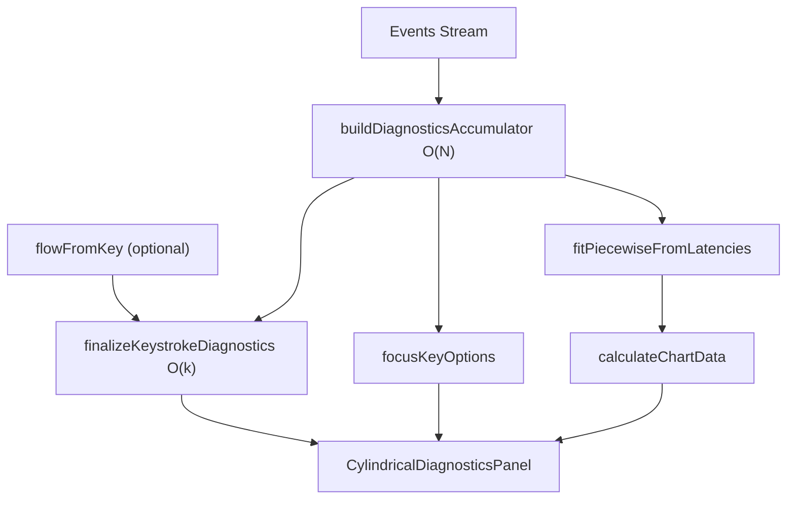

# TypeDiag: Cylindrical Diagnostics Specification

This document details the architecture, terminology, and statistical algorithms powering the **Cylindrical Vector Diagnostics Drawer**. It serves as the Single Source of Truth (SSOT) for the data flow across the `Key`, `Flow`, and `Pro` UI columns.

---

## 1. Core Terminology & Transitions

The diagnostics engine reads the linear `KeyEvent` stream `{ fromKey, toKey, latencyMs, holdDurationMs, isCorrect, expectedChar }` bidirectionally around a selected **focusKey**.

| Term | Symbol / Code | Definition | Primary Use Case |
| :--- | :--- | :--- | :--- |
| **focusKey** | `focusKey` | The primary target key being analyzed. | Pivot for all Key & Pro metrics. |
| **flowFromKey**| `flowFromKey` | The specific `fromKey` driving the Flow column. Resolved automatically if not explicit. | Flow metrics (speed, hesitation, late keystroke). |
| **reference transition** | `toKey === focusKey` | The user is transitioning **into** the focusKey. | Piecewise Regression, MAD, Cylindrical Vectors ($\theta, r, z$). |
| **outgoing transition** | `fromKey === focusKey` | The user is transitioning **out** of the focusKey. | Cloud Typing ($L$, $ND$). |
| **Hold** | $D$ / `holdDuration` | Duration the focusKey is held down (tracked on reference transition). | Cloud Typing ($ND$ calculation). |
| **Latency** | $L$ / `latencyMs` | Time taken to transition to the next key (tracked on outgoing transition). | Cloud Typing ($ND$ calculation). |

### Event Matrix Example
```
Row i-1   … → f   toKey=f     holdDurationMs=D   ← reference transition
Row i     f → …   fromKey=f   latencyMs=L        ← outgoing transition
```

---

## 2. Architecture & Data Flow

The architecture strictly separates the **$\mathcal{O}(N)$ Accumulation** phase from the **$\mathcal{O}(k)$ Finalization** phase. This guarantees that swapping the `focusKey` in the UI does not require re-scanning the entire event stream.



### Module Responsibilities
| Layer | SSOT File |
| :--- | :--- |
| **UI Panel** | `CylindricalDiagnosticsPanel.tsx` (Key / Flow / Pro Grids) |
| **React Hook** | `useCylindricalDiagnostics.ts` |
| **$\mathcal{O}(N)$ Accumulator** | `cylindricalStats/accumulator.ts` (`buildDiagnosticsAccumulator`) |
| **$\mathcal{O}(k)$ Finalizer** | `cylindricalStats/finalize.ts` (`finalizeKeystrokeDiagnostics`) |
| **Cloud Typing Engine** | `cylindricalStats/cloudTyping.ts` |
| **Piecewise Regression** | `utils/piecewiseRegression.ts` |

---

## 3. UI Metrics & Algorithms

### 3.1. Key Column (Focus Key Dynamics)
Metrics focused on the overall health and history of the `focusKey`.

- **Latency Trend (Piecewise Regression)**: Uses Muggeo's method to fit two linear segments to the historical reference latencies, detecting the exact pivot point (inflection) where the user's learning curve flattens out.
- **Speed Consistency (rMAD)**: Calculates the Median Absolute Deviation relative to the median. Evaluated as `steady`, `moderate`, or `erratic`.
- **Typo Inducement Rate**: Percentage of error streaks that were initiated when the user *intended* to hit the `focusKey` (`charToLayoutKey(expectedChar)`).
- **Finger Transition Comparison**: Measures speed differences when transitioning from keys hit by the same hand.

### 3.2. Flow Column (`flowFromKey` $\rightarrow$ `focusKey`)
Metrics restricted strictly to the reference transition from the `flowFromKey`.
- **flowFromKey Resolution**: If not explicitly provided by the UI, it defaults to the valid `fromKey` with the highest number of correct reference samples.
- **Hesitation**: Calculates the percentage of latencies that exceed $Q_3 + 1.5 \times \mathrm{IQR}$. Above 5% triggers a "Hesitation Suspected" warning.
- **Late Keystroke (Reversed Order)**: Detects physical typos where the user typed the `focusKey` and `flowFromKey` in reverse order.
  - *Logic*: Iterates through consecutive typos. If the previous intended key (`prevExpected`) was the `focusKey`, and the current intended key (`currExpected`) is the `flowFromKey`, a reversal is flagged.

### 3.3. Pro Column (Spatial & N-Gram Analysis)

#### Cloud Typing (Rollover Overlap)
Measures how fluidly the user overlaps key presses.
- **Metric ($ND$)**: Normalized Difference between Hold ($D$) and outgoing Latency ($L$).
  $$ND = \frac{|L - D|}{\max(L + D, M)}$$
  (where $M$ is `CLOUD_TYPING_MIN_DENOM`, defaulting to 300ms).
- Values approaching 0 indicate perfect "Cloud Typing" (the next key is pressed exactly as the previous is released). $ND \leq 0.25$ is considered a successful cloud stroke.
- Evaluates Pearson correlation ($r$) between $ND$ and $L$ to determine effectiveness.

#### Contextual 3-Grams (Fatal N-Grams)
Identifies sequences where the user consistently fails on the `focusKey` despite hitting the previous two keys correctly.
- **Accumulator Window (`window3Gram`)**: Maintains a running window of the last 2 correct, consecutive alphabetic keystrokes.
- **Trigger**: The window forms $[K_1 \checkmark, K_2 \checkmark]$. The next event is evaluated against the `focusKey`. Both correct hits and typos (resolved via `expectedChar`) are counted.
- **Threshold**: Minimum 10 samples, error rate strictly $> 20\%$.

#### Burst N-Grams (High-Speed Sequences)
Identifies extreme high-speed sequences (2-gram or 3-gram) that involve the `focusKey`.
- **Accumulator Window (`windowFast`)**: Resets when a latency exceeds 30ms. Extends as long as subsequent consecutive alphabetic characters are typed $\leq 30ms$.
- **Metric**: Averages the latency of the sequence. If the `focusKey` is part of the sequence and it occurs $\geq 10$ times, it is ranked in the top 3 bursts.
