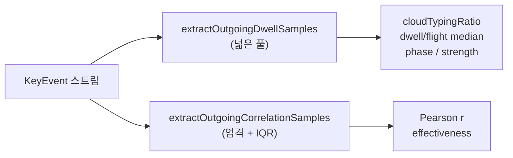
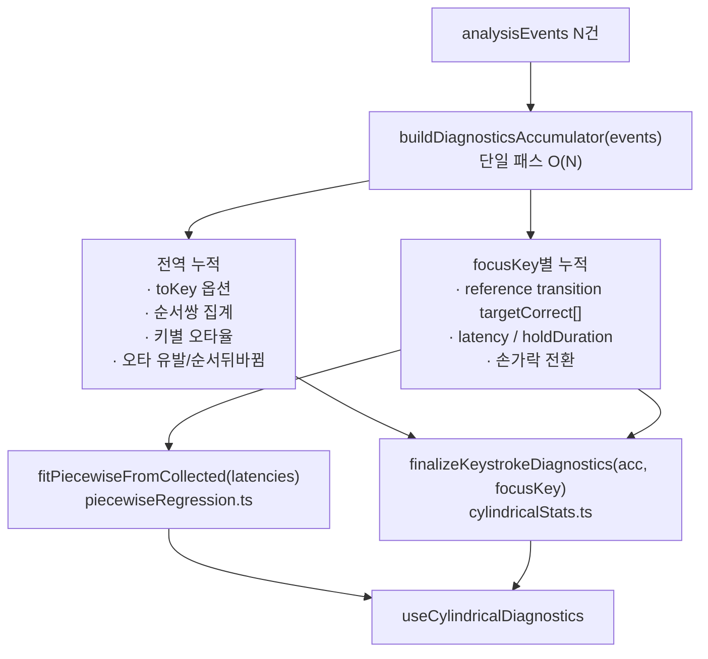

# TypeDiag: 지연 진단 통계 & Piecewise Regression 명세서

이 문서는 **TypeDiag**에서 사용자의 타건 개선 추이를 파악하기 위해 사용하는 핵심 통계 알고리즘인 **분절 선형 회귀 (Piecewise Linear Regression)**의 동작 방식과 수학적/기술적 로직을 정리한 명세서입니다.

### Cylindrical Diagnostics 용어 (SSOT)

| 용어 | 코드 | 필터 |
| :--- | :--- | :--- |
| **focusKey** | `focusKey` | 진단 패널에서 사용자가 선택한 분석 초점 키 |
| **reference transition** (기준 쌍) | — | `toKey === focusKey` |
| **outgoing transition** | — | `fromKey === focusKey` |

UI SSOT: `src/components/workspace/CylindricalDiagnosticsPanel.tsx` · 통계 SSOT: `src/utils/cylindricalStats.ts` · 훅: `src/hooks/useCylindricalDiagnostics.ts`

---

## 1. 2D Piecewise Linear Regression (분절 선형 회귀)

사용자가 특정 키를 반복 연습함에 따라 지연 시간(latencyMs)이 개선되는 양상을 두 개의 연결된 직선으로 피팅하는 수학적 회귀 모델입니다. 

기존의 단순 선형 회귀와 달리, **"사용자가 연습을 통해 정체기를 극복하거나 급격히 속도가 개선되는 특정 변곡점(Breakpoint)"**을 수학적으로 탐지하는 데 목적이 있습니다.

```
지연 시간 (latencyMs)
  ▲
  │   \ (기울기: β1)
  │    \
  │     \
  │──────*────────────── (변곡점 c)
  │       \ (기울기: β1 + β2)
  │        \────────────────
  └──────────────────────────► 시간 순서 (Index)
```

### 1.1. 수학적 모델 방정식
$$y = \beta_0 + \beta_1 x + \beta_2 \max(0, \, x - c)$$
*   **$x \le c$ (분절점 이전)**: $y = \beta_0 + \beta_1 x$
*   **$x > c$ (분절점 이후)**: $y = (\beta_0 - \beta_2 c) + (\beta_1 + \beta_2) x$
    *   $\beta_0$: 절편 (Intercept)
    *   $\beta_1$: 분절 이전의 기울기 (Slope Before)
    *   $\beta_2$: 분절 전후의 기울기 변화량 (Slope Difference)
    *   $\beta_1 + \beta_2$: 분절 이후의 최종 기울기 (Slope After)
    *   $c$: 분절점 (Breakpoint, 개선 변곡점)

---

### 1.2. 단계별 알고리즘 및 코드 로직

전체 연산 흐름은 `src/utils/piecewiseRegression.ts` 의 `fitPiecewiseLinearWithDiagnostics` 함수를 통해 가동됩니다.


#### 1.1단계. 데이터 필터링 및 윈도잉 (`aggregateToWindows`)
1.  **이상치 차단**: focusKey(`toKey === focusKey` reference transition)의 정타 이벤트 중 `latencyMs`가 0보다 크고 이상치 상한 임계값(`upperBoundMs`) 이하인 유효 데이터만 추립니다. (유효 데이터가 20개 미만일 시 연산 중단)
2.  **구간별 중앙값 집계**: 노이즈를 제어하기 위해 유효 데이터를 시간순으로 정렬한 후 **20개의 균등 윈도우**로 분할합니다.
3.  **대표 점 도출**:
    *   **$X$ 좌표**: 각 윈도우 구간의 중간 인덱스 (인덱스 스케일 보존)
    *   **$Y$ 좌표**: 각 윈도우 구간 내의 `latencyMs` 중앙값 (Median)
    *   이를 통해 최종 20개의 가공된 대표 데이터 포인트 $(x_i, y_i)$ 가 준비됩니다.

#### 1.2단계. 그리드 서치 (`gridSearchC0`)
변곡점 $c$가 위치할 수 있는 최적의 초기 후보값 $c_0$를 선정합니다.
*   데이터 양 끝단 10% 영역을 제외한 나머지 범위 내에서, 후보 $c$를 대입하여 OLS(최소제곱법)로 직선을 피팅하고 **오차제곱합(RSS, Residual Sum of Squares)**을 전수 조사합니다.
*   RSS가 가장 작게 나타나는 지점의 $X$ 값을 초기 분절점 $c_0$로 확정합니다.

#### 1.3단계. 무제오 알고리즘 (`muggeoMethod`)
그리드 서치로 얻은 $c_0$를 무제오 알고리즘(Muggeo's Method, 2003)을 통해 소수점 이하 단위까지 정밀 수렴시킵니다.
1.  **4열 설계 행렬 구성**:
    $$\mathbf{X}_{\text{design}} = \begin{bmatrix} 1 & x_i & \max(0, x_i - c) & I(x_i > c) \end{bmatrix}$$
    *   $I(x_i > c)$는 $x_i$가 $c$보다 크면 1, 아니면 0인 지시 함수(Indicator Function) 열입니다.
2.  **OLS 해 계산**:
    $$\boldsymbol{\beta} = (\mathbf{X}^T \mathbf{X})^{-1} \mathbf{X}^T \mathbf{y}$$
    *   가우스-조르당 소거법을 사용해 수치적으로 역행렬을 계산하여 $\boldsymbol{\beta} = \begin{bmatrix} \beta_0 & \beta_1 & \beta_2 & \beta_3 \end{bmatrix}^T$를 도출합니다.
3.  **분절점 업데이트**:
    $\beta_3$(지시 함수 계수) 값을 $\beta_2$(기울기 변화량)로 나누어 분절점 $c$의 수정 방향과 크기를 구합니다.
    $$c_{\text{new}} = c - \frac{\beta_3}{\beta_2}$$
4.  **수렴 루프**:
    이 과정을 업데이트 격차가 $10^{-6}$ 이하가 되거나 최대 50회 도달할 때까지 반복하여 수렴된 최종 $c$를 얻습니다.

#### 1.4단계. 최종 OLS 적합 및 방정식 산출
1.  수렴된 최종 분절점 $c$를 기준으로 3열 설계 행렬 $\mathbf{X}_{\text{design}} = \begin{bmatrix} 1 & x_i & \max(0, x_i - c) \end{bmatrix}$을 빌드합니다.
2.  최종 OLS를 수행하여 계수 $\beta_0, \beta_1, \beta_2$를 계산하고 예측 함수 `predict(x)`를 반환합니다.

---

## 2. 기타 진단 통계 지표 (요약)

| 지표명 | 측정 목적 및 로직 요약 |
| :--- | :--- |
| **Cloud Typing (Dwell · Flight)** | 선택 키 **outgoing** 전이 집계 — 롤오버(구름타법) 비율·dwell/flight·효과성 상관. 상세: **§2.1**. |
| **Hesitation Ratio** | 사분위수 기준 이상치 한계선($Q_3 + 1.5 \times \text{IQR}$)보다 현저히 늦게 입력된 타건 비율을 집계 (5% 이상 시 머뭇거림 의심). |
| **Late Keystroke** | 타이핑이 빠를 때 발생하는 오타 유형으로, 떼는 타이밍 누수로 인해 뒤의 키가 먼저 입력되는 현상을 감지. |
| **Error Inducement** | 오타 스트릭이 시작된 최초 입력 시점들 중, 현재 키를 입력하려다가 스트릭이 깨진 오타 시작 기여도를 측정. |
| **Shift Overhead** | Shift 조합 글자(ㅃ, ㅉ, ㄸ 등) 입력 시 단독 입력 대비 추가로 지연되는 평균 패널티 및 좌/우 Shift 편향 분석. |
| **Finger Transitions** | 대상 키 바로 직전에 입력된 이전 키의 손가락 위치 분포를 분석하여 특정 이동 경로상의 병목 트래킹. |

---

## 2.1. Cloud Typing — 구름타법 (Dwell · Flight)

Cylindrical Diagnostics **Panel 3** 카드 **「구름타법 · Dwell / Flight」** 에 해당하는 지표입니다.  
코드 SSOT: `src/utils/cylindricalStats.ts` (`computeCloudTypingDiagnostics` 등)  
UI SSOT: `src/components/workspace/CylindricalDiagnosticsPanel.tsx` (`CloudTypingView`)  
테스트: `src/utils/cloudTyping.test.ts`, `src/hooks/useCylindricalDiagnostics.test.ts`

### 2.1.1. 진단 목적

일반 타자기의 WPM/CPM만으로는 잡히지 않는 **키 릴리즈·롤오버(겹침) 타이밍**을 측정합니다.

- 사용자가 진단 패널에서 **focusKey** 를 고르면, 그 키를 **누른 뒤 다음 키로 넘어갈 때** 이전 키를 얼마나 겹쳐 잡는지(구름타법)를 정량화합니다.
- **비율(%)**: 이 키에서 롤오버 패턴이 얼마나 자주 나타나는지 (숙달/미적용).
- **효과성(r)**: 롤오버 정도(ND)와 전이 속도(latency)가 함께 움직이는지 — 속도와 맞물리면 효과적, 겹치려다 느려지면 역효과.

SKDM의 3D 지연 지형과 별도로, **1차원 홀드·비행 시간 분해**에 초점을 둔 보조 진단입니다.

### 2.1.2. 용어 정의

| 용어 | 정의 |
| :--- | :--- |
| **구름타법** | 이 문서·코드에서의 operational 정의: **롤오버(키 겹침)**. 이전 키를 충분히 오래 누른 채 다음 키 IKI 안에 다음 키를 누르는 패턴. |
| **focusKey** | Cylindrical Diagnostics에서 사용자가 선택한 분석 초점 키. 코드·UI SSOT: `focusKey` / `setFocusKey`. |
| **전이 (transition)** | 연속된 두 `KeyEvent` 사이: `fromKey` → `toKey`, `latencyMs` = 두 keydown 간격(IKI). |
| **reference transition** (기준 쌍) | `toKey === focusKey` — focusKey **입력 행** 기준. 분절회귀·Latency·CPM·손가락 전환 등 **들어오는(to) 축** 집계. |
| **outgoing transition** (나가는 전이) | `fromKey === focusKey` — focusKey **다음 키로 나가는** 전이. **구름타법** 집계 축. |
| **hold / holdDurationMs** | 물리 키를 누른 시점부터 뗀 시점까지(ms). `handlePhysicalKeyRelease` 시 해당 `toKey` 이벤트에 기록 (`createKeystrokeSlice.ts`). |
| **latencyMs (L)** | outgoing transition에서 **다음 키 keydown**까지의 IKI. |
| **dwell (D)** | $\min(\text{hold}, L)$ — IKI 구간 중 focusKey(reference transition 행)가 아직 눌려 있던 시간(겹침 구간). |
| **flight** | $\max(0, L - \text{hold})$ — focusKey를 뗀 뒤 다음 키까지 공중에 있던 시간. |
| **ND (Normalized Difference)** | $\dfrac{L - D}{L + D}$. 분모는 단일 변수 $D$가 아니라 **$L+D$ 합**. 롤오버일수록 $D \to L$, **$ND \to 0$**. 순차 타이핑(긴 flight)일수록 **$ND \to 1$**. |
| **구름 stroke** | 한 번의 outgoing 전이가 롤오버로 분류된 경우: $ND \le 0.3$. |
| **cloudTypingRatio** | outgoing 전이 중 구름 stroke 비율 (0~1). UI의 큰 **%** 숫자. |
| **phase** | `skilled` (≥70%) / `not_applied` (<70%). |
| **effectiveness** | ND↔latency 피어슨 r 기반: `effective` / `counterproductive` / `neutral`. |

#### 왜 outgoing인가

구름타법은 **「이 키를 얼마나 오래 겹쳐 잡고 다음 키로 넘어가는가」** 의 문제입니다.  
그 타이밍은 focusKey **reference transition 행**의 `holdDurationMs`에 담기며, **다음 키가 눌릴 때** 비로소 outgoing transition으로 관측됩니다.

reference transition(`toKey === focusKey`)은 **앞 키에서 focusKey로 들어올 때**의 접근·속도를 보는 축이므로, focusKey 자체의 구름타법(롤오버)과는 다른 질문입니다.

#### 집계 단위

- **순서쌍 하나(dominant pair)가 아님.** `f→j`, `f→a`, … 등 **focusKey outgoing transition 전체를 한 풀에 합산**합니다.
- 목적지 `toKey`별 top-N 분해는 **현재 미구현**.

### 2.1.3. 입력 데이터 · hold 기록

| 항목 | 내용 |
| :--- | :--- |
| 이벤트 소스 | 현재 Run/Page의 `KeyEvent[]` (`useCylindricalDiagnostics` → `calculateKeystrokeDiagnostics`) |
| hold 부여 시점 | keyup (`handlePhysicalKeyRelease`) — 마지막으로 일치하는 `toKey` 이벤트에 `holdDurationMs` 기록 |
| keydown 시 | 새 이벤트의 `holdDurationMs`는 `null` |
| 롤오버 분석 시점 | 페이지 단위 **사후 분석**. 분석 시점에는 대부분의 이전 키에 hold가 채워져 있음 (아직 누르고 있는 키는 제외) |

**제외 조건 (다음 키 `toKey`)** — `CLOUD_TYPING_EXCLUDE_TO_KEYS`:

`shift_l`, `shift_r`, `backspace`, `enter`

**상관 풀 추가 제외 (focusKey 자체)** — `CLOUD_TYPING_CORRELATION_EXCLUDE_FROM_KEYS`에 focusKey가 있으면 상관 샘플 0건 (예: `backspace` 키 선택 시).

### 2.1.4. 샘플 추출 — 두 개의 풀 (의도적 분리)

동일 outgoing 전이라도 **비율 집계**와 **효과성 상관**은 필터가 다릅니다.



#### hold · latency 출처 (두 개의 행)

hold는 **전이 쌍(from→to) 메타데이터가 아니다.** KeyEvent **한 행**에 붙는다.

| 값 | 읽는 행 | 조건 |
| :--- | :--- | :--- |
| **hold** | **reference transition** | `toKey === focusKey` — focusKey를 **누른** keypress 이벤트 |
| **latency (L)** | **outgoing transition** | `fromKey === focusKey` — focusKey **다음** keypress 이벤트 |

```
행1  a → f   toKey=f  holdDurationMs=120   ← reference (f를 누른 줄)
행2  f → j   fromKey=f  latencyMs=70       ← outgoing (j를 누른 줄)
```

코드는 outgoing 행 인덱스 `i`에서 `events[i - 1]`을 **candidate**로 읽되, `referenceEvent.toKey === focusKey`로 reference 행인지 검증한다. 인덱스는 탐색 편의일 뿐, hold의 의미적 출처는 reference transition 행이다.

#### 공통 조건 (outgoing transition)

**outgoing transition 행**과 짝이 되는 **reference transition 행**(`toKey === focusKey`)에 대해:

1. `outgoingEvent.fromKey === focusKey`
2. `outgoingEvent.isCorrect === true`, `outgoingEvent.latencyMs > 0`
3. `outgoingEvent.toKey` ∉ exclude 목록
4. `referenceEvent.toKey === focusKey` — hold가 **focusKey reference transition 행** 것임을 보장
5. `referenceEvent.holdDurationMs` 유효 (number, non-null)

샘플 필드:

- `fromHoldMs` = `referenceEvent.holdDurationMs` (focusKey 홀드)
- `latencyMs` = `outgoingEvent.latencyMs` (outgoing IKI)

#### 넓은 풀 — `extractOutgoingDwellSamples`

- 위 공통 조건만 적용.
- **`referenceEvent.isCorrect` 검사 없음** — focusKey reference transition 직후 나가는 정답 outgoing도 비율에 포함될 수 있음.

#### 엄격 풀 — `extractOutgoingCorrelationSamples`

- 공통 조건 + **`referenceEvent.isCorrect === true`** (reference transition 정답만)
- 이후 `filterCorrelationLatencyOutliers` (IQR) 적용.

#### IQR 필터 (상관 전용)

머뭇거림·pause로 latency가 비정상적으로 긴 전이는 ND↔latency 상관을 0 근처로 눌러 **효과성 r을 왜곡**합니다. Hesitation 지표와 동일 계열의 Tukey 규칙:

$$\text{maxLatency} = \min\bigl(Q_3 + 1.5 \times \mathrm{IQR},\; 4 \times \mathrm{median}(L)\bigr)$$

`latencyMs > maxLatency` 인 샘플 제거. 필터 후 5건 미만이면 **필터 전 샘플**을 그대로 사용.

> **주의:** IQR 필터는 **큰 %·dwell 바에는 적용되지 않음.** 상관 `r`·효과성 라벨에만 영향.

### 2.1.5. 수학 모델

각 outgoing 샘플에 대해:

$$D = \min(\text{hold}, L)$$

$$\text{flight} = \max(0,\; L - \text{hold})$$

$$\mathrm{ND} = \frac{L - D}{L + D}$$

항등식: 샘플마다 $D + \text{flight} = L$.

**구름 stroke 판정:**

$$\mathrm{ND} \le 0.3 \quad (\texttt{CLOUD\_TYPING\_ND\_MAX})$$

경계 직관 ($L=100$ ms일 때): $D \gtrsim 54$ ms (hold가 IKI의 ~54% 이상 겹치면 stroke).

| hold | L | D | ND | stroke? |
| :---: | :---: | :---: | :---: | :---: |
| 100 | 80 | 80 | 0 | ✅ |
| 60 | 100 | 60 | 0.25 | ✅ |
| 54 | 100 | 54 | 0.30 | ✅ 경계 |
| 40 | 100 | 40 | 0.43 | ❌ |

### 2.1.6. 집계 · 분류 로직

`computeCloudTypingDiagnostics(events, focusKey)` 흐름:

1. `outgoingSamples` ← 넓은 풀  
2. `correlationSamples` ← 엄격 풀 + IQR  
3. 각 correlation 샘플의 ND 배열 vs `latencyMs` → `computePearsonCorrelation` → `effectivenessCorrelation`  
4. `outgoingSamples` 전체로 stroke 카운트 → `cloudTypingRatio`, `sessionCloudTypingRatio` (현재 동일 값)  
5. median 집계: `dwellMs`, `flightMs`, `latencyMs`, `normalizedDifference` (ND 중앙값)  
6. `outgoingSamples.length < 1` 이면 `key: null` (UI: «나가는 전이 데이터 없음»)

#### phase · strength (비율만 사용, r과 독립)

| 조건 | `phase` | `strength` (skilled일 때만) |
| :--- | :--- | :--- |
| `cloudTypingRatio ≥ 0.9` | `skilled` | `strong` |
| `≥ 0.8` | `skilled` | `moderate` |
| `≥ 0.7` (`CLOUD_TYPING_RATIO_SKILLED_THRESHOLD`) | `skilled` | `weak` |
| `< 0.7` | `not_applied` | `null` |

#### effectiveness (상관만 사용, 비율과 독립)

유의성: $|r| > 0.3$ 이고 $p < 0.05$, 최소 5 샘플 (`CLOUD_TYPING_CORRELATION_MIN_SAMPLES`).

| 조건 | `effectiveness` | UI 라벨 |
| :--- | :--- | :--- |
| $r \ge +0.3$ (유의) | `effective` | 구름타법 효과적 (속도 향상) |
| $r \le -0.3$ (유의) | `counterproductive` | 구름타법 역효과 (타건 꼬임) |
| 그 외 유의 | `neutral` | 상관 없음 |
| 비유의 | — | 구름타법 상관 무의미 |

**해석 (롤오버 모델):**

- **양의 r**: 빠른 전이일수록 ND도 낮음(롤오버↑) — 속도와 겹침이 같이 움직임 → 효과적.
- **음의 r**: ND는 낮은데(겹치려 함) latency는 높음 — 끼어들기·꼬임 → 역효과.

### 2.1.7. UI 매핑 (`CloudTypingView`)

| UI 요소 | 데이터 필드 |
| :--- | :--- |
| 큰 `NN%` | `key.cloudTypingRatio × 100` |
| `구름타법 숙달` / `미적용` | `key.phase` |
| `f 키 · 나가는 전이 n=12` | `key.key`, `key.sampleCount` |
| `상관 n=… r=…` | `effectivenessCorrelation.sampleCount`, `pearsonR` |
| `구름타법 강함/보통/약함` | `key.strength` |
| 효과성 한 줄 (색상) | `effectiveness` + `isSignificant` |
| Dwell / Flight 바 | `dwellMs / latencyMs` (median), ms 라벨은 각 median |
| 데이터 없음 | `key === null` |

### 2.1.8. 상수 일람 (`cylindricalStats.ts`)

| 상수 | 값 | 용도 |
| :--- | :--- | :--- |
| `CLOUD_TYPING_ND_MAX` | `0.3` | stroke 상한 ND |
| `CLOUD_TYPING_RATIO_SKILLED_THRESHOLD` | `0.7` | skilled phase |
| `CLOUD_TYPING_CORRELATION_R_THRESHOLD` | `0.3` | \|r\| 유의 하한 |
| `CLOUD_TYPING_CORRELATION_P_THRESHOLD` | `0.05` | p-value |
| `CLOUD_TYPING_CORRELATION_MIN_SAMPLES` | `5` | 상관 최소 n |
| `CLOUD_TYPING_KEY_MIN_SAMPLES` | `1` | 키 집계 최소 outgoing n |

### 2.1.9. API 타입

```ts
interface CloudTypingDiagnostics {
  effectivenessCorrelation: HoldCorrelationResult;
  effectiveness: "effective" | "counterproductive" | "neutral";
  sessionCloudTypingRatio: number; // outgoing stroke 비율 (key와 동일 풀)
  key: CloudTypingKeyResult | null;
}

interface CloudTypingKeyResult {
  key: string;
  dwellMs: number;
  flightMs: number;
  latencyMs: number;
  normalizedDifference: number;
  cloudTypingRatio: number;
  sampleCount: number;
  phase: "skilled" | "not_applied";
  strength: "strong" | "moderate" | "weak" | null;
}
```

### 2.1.10. 알려진 제한

- **hold null**: 페이지 완료 keydown 시점에 마지막 키 hold 미기록 가능. 이후 outgoing 전이 샘플 누락.
- **비율 vs 상관 샘플 수 불일치**: 의도된 설계(§2.1.4). UI에 `나가는 전이 n`과 `상관 n`이 다를 수 있음.
- **특수키 focusKey**: `backspace` 등은 상관 풀이 비어 있을 수 있음.
- **임계값 0.3**: 롤오버 경계 — 실측 세션으로 재캘리브레이션 여지 있음 (`CLOUD_TYPING_ND_MAX` 한 곳).

---

## 3. Cylindrical Diagnostics 패널 구성 (3-Panel)

Cylindrical Vector 진단 드로어는 동일 너비 3열 그리드로 구성합니다.  
UI SSOT: `src/components/workspace/CylindricalDiagnosticsPanel.tsx`  
스타일: `src/app/styles/cylindrical-visualizer.css`

### Panel 1 · 키 진입 Dynamics

| 지표 | 비고 |
| :--- | :--- |
| 모래시계 분절회귀 | §1 Piecewise Regression |
| Latency 분포 · 일관성 (MAD) | 오락가락 vs 일정 — `latencyConsistency` (MAD, rMAD, 히스토그램) |
| 오타 유발율 | 전체 키 중 처음 오타를 유발한 비율 |
| 동일 손 손가락별 속도 비교 | 같은 손 다른 손가락 대비 빠름/느림 |
| 어느 손가락에서 넘어오는지 | 직전 키 손가락 전환 비율 |
| 무의식적 incorrect 키 TopN | optional |
| Shift 지연 패널티 | optional — 시프트 때문에 느려지는 키 |

### Panel 2 · 타이밍 & 오타

| 지표 | 비고 |
| :--- | :--- |
| Latency 중앙값 · CPM | focusKey reference transition 정타 기준 |
| IQR 기반 머뭇거림 | Q3 + 1.5×IQR 초과 비율 |
| 순서 뒤바뀜 오타율 | 오타 쌍 중 이 키를 늦게 눌러 순서가 바뀐 비율 |
| 자주 쓰는 순서쌍 TopN | optional |

### Panel 3 · 공간 & 패턴

| 지표 | 비고 |
| :--- | :--- |
| 공간적 오타 거리 | `expectedChar === focusKey && isCorrect === false` — reference transition 정답↔실제 `toKey` 거리 Q1·Q2·Q3 궤도 시각화 |
| Dwell · Flight (구름타법) | §2.1 — outgoing transition 집계, ND≤0.3 롤오버 %, dwell/flight 바, 효과성 r |
| N단계 전이 오타 패턴 | optional — **미구현** |
| 버스트 쌍 포함 여부 | optional — **미구현** |

---

## 4. 진단 통계 계산 리팩터링 (Planned)

### 4.1. 배경 · 문제

현재 `useCylindricalDiagnostics`는 `events` 배열에 대해 **독립적인 `useMemo` 블록**으로 계산합니다.

| 블록 | SSOT | 스캔 범위 |
| :--- | :--- | :--- |
| `toKeyOptions` | `countCorrectEventsByToKey` | O(N) |
| 분절회귀 | `fitPiecewiseLinearWithDiagnostics` | O(N) 필터 + 고정 20윈도우 회귀 |
| Keystroke 통계 | `calculateKeystrokeDiagnostics` | O(N) 다중 패스 + `.filter()` 할당 |

`calculateKeystrokeDiagnostics`(`src/utils/cylindricalStats.ts`)는 동일한 `events`를 **5~7회** 순회하며, `events.filter(...)`로 **중간 배열을 3개 이상** 생성합니다.  
분절회귀도 `toKey === focusKey`(reference transition) && `isCorrect` 조건으로 **별도 필터**를 수행합니다.

Run 단위 `analysisEvents`(수천~수만 건)에서는 체감 지연이 없으나, 통계 항목이 늘거나 데이터 범위가 커지면 **O(통계수 × N)** 및 **GC 할당**이 누적됩니다.

### 4.2. 원칙 — 스캔은 합치고, 알고리즘은 분리

| 계층 | 합침 여부 | SSOT 유지 |
| :--- | :--- | :--- |
| **이벤트 1패스 수집 (Accumulator)** | ✅ 합침 | 신규 `buildDiagnosticsAccumulator` (예정) |
| **분절회귀 연산** (Grid Search, Muggeo, OLS) | ❌ 분리 | `src/utils/piecewiseRegression.ts` |
| **Keystroke 집계·비율·상관** | ❌ 분리 (입력만 공유) | `src/utils/cylindricalStats.ts` |
| **SKDM upperBound** (`ensureFinalUpperBound`) | ❌ 분리 | `src/lib/dev/piecewiseDev.ts` — 진단 진입 시 1회 |

분절회귀 **수학 모듈을 cylindricalStats에 합치지 않습니다.** 패리티 테스트(`piecewiseRegression.test.ts`)와 Muggeo/OLS SSOT를 보존합니다.

### 4.3. 목표 아키텍처



**1패스 Accumulator가 모으는 것 (예정)**

- **전역**: `toKeyOptions`, 순서쌍 빈도, 키별 correct/incorrect, 오타 유발·순서 뒤바뀜 카운트
- **focusKey 전용** (순서 유지): reference transition 정답, latency 시퀀스, holdDuration 쌍, 손가락 전환, 동일 손 타 키 latency

**분절회귀 입력 경로 (예정)**

```ts
// 현재: events 전체를 다시 필터 (reference transition)
fitPiecewiseLinearWithDiagnostics(events, focusKey)

// 리팩터 후: 수집된 시퀀스만 전달 (내부 20윈도우·회귀 동일)
fitPiecewiseFromLatencies(orderedLatencies, { focusKey, upperBoundMs })
```

기존 `fitPiecewiseLinearWithDiagnostics(events, …)` 시그니처는 **얇은 래퍼**로 유지해 호출부 호환을 보장할 수 있습니다.

### 4.4. 합쳐도 줄지 않는 비용

단일 패스로 전환해도 아래는 그대로입니다.

- 선택 키 정답 latency에 대한 **median / IQR 정렬** — O(k log k)
- 분절회귀 **20윈도우 이후 회귀** — O(1)에 가까움
- `ensureFinalUpperBound` → SKDM `runPipeline` — 진단 진입 시 별도 1회

리팩터링의 실질 이득은 **CPU k배 가속**보다 **중복 filter·중간 배열 제거** 및 **신규 통계 추가 시 N 스캔 증가 방지**에 있습니다.

### 4.5. 미구현 통계 구현 시 가이드

§3 Panel 1~3의 **미구현** 항목은 구현 시 아래를 따릅니다.

| 지표 | 권장 방식 |
| :--- | :--- |
| Latency 분포 (MAD) | `computeLatencyConsistency` — focusKey reference transition 정답 latency에 MAD/rMAD, 5건 미만 시 null |
| 공간적 오타 거리 | `getSpatialErrorDistance` — 오타 이벤트 스캔, `buildLayout` 좌표 lookup |
| Dwell · Flight | §2.1 구현 완료 — `extractOutgoingDwellSamples`, `computeCloudTypingDiagnostics` |
| N단계 전이 패턴 | 최근 N건 또는 고정 윈도우 (예: 2,000건) |
| 버스트 쌍 | latency 임계값 기반 연속 구간 탐지 — 윈도우 스캔 |

전체 히스토리(수십만 건 이상) 기준 진단이 필요해지면 **서버 pre-aggregate**(DB 집계) 또는 **Web Worker** 분리를 별도 검토합니다. Run 단위 MVP에서는 §4.3 accumulator 리팩터만으로 충분합니다.

### 4.6. 작업 체크리스트 (예정)

- [ ] `DiagnosticsAccumulator` 타입 및 `buildDiagnosticsAccumulator(events)` 구현
- [ ] `calculateKeystrokeDiagnostics` → accumulator 소비형 `finalizeKeystrokeDiagnostics`로 전환
- [ ] `fitPiecewiseFromLatencies` (또는 collected events 입력) 추가, 기존 API 래퍼 유지
- [ ] `useCylindricalDiagnostics`에서 단일 accumulator 생성 후 분기
- [ ] 기존 `useCylindricalDiagnostics.test.ts` · `cylindricalStats` · `piecewiseRegression` 테스트 통과
- [ ] §3 미구현 통계를 accumulator 확장 포인트에 순차 추가
