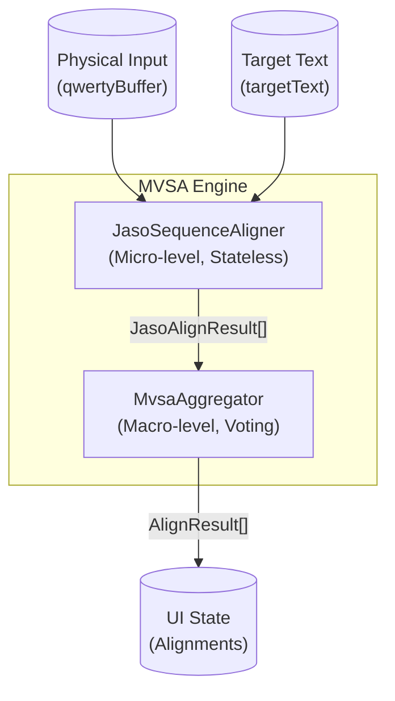

# MVSA (Maximum Valid Sequence Aligner) Algorithm Specification

## 1. Introduction & Design Intent

The **MVSA (Maximum Valid Sequence Aligner)** is a real-time, heuristic state machine and alignment engine specifically designed for typing validation in TypeDiag.

### Why not standard algorithms?
General string alignment algorithms like Longest Common Subsequence (LCS) or Levenshtein Distance fall short when applied to real-time Korean typing:
1. **Intermediate Hangul States**: Hangul composition involves intermediate jamo (phoneme) combinations (e.g., typing '하' on the way to '한'). Standard algorithms often penalize this as a mismatch.
2. **Carry-over (도깨비불 현상)**: A trailing consonant (종성) from the previous character may temporarily attach to the next character's leading consonant (초성). A rigid character-by-character alignment fails to handle this natural IME behavior smoothly.
3. **Typo Cascading**: A single omitted character in LCS or Left-to-Right matchers can cause the rest of the string to misalign, creating unnatural error boundaries.

### MVSA Philosophy
MVSA aims to **maximize the recognition of valid sequences** while strictly bounding the impact of typos. It assumes that typos are localized anomalies.
- **Jaso-level precision**: All alignments are performed at the Jaso (Jamo/Alphabet) level.
- **Stateless & Word-Isolated**: Eliminates the need for manual backspace handling and prevents cross-word typo cascading.
- **Right-to-Left (R2L) Recovery**: Boxes typos between the last known good state and the next anchor, mirroring human intent.

---

## 2. Core Architecture: Separation of Concerns

The architecture strictly separates mathematical alignment logic from visual UI aggregation.

1. **`JasoSequenceAligner` (`mvsaJasoCore.ts`)**: 
   A stateless engine that breaks down strings into English-mapped jamo arrays. It performs the alignment using an *Incremental Heuristic* and outputs fine-grained jaso-level alignment results.
2. **`MvsaAggregator` (`mvsaAggregator.ts`)**: 
   Takes the jaso-level results, maps them back to their corresponding physical keystrokes and visual character boundaries, resolves target matching via a voting mechanism, and emits the final UI-ready state.

---

## 3. Micro-level Alignment (JasoSequenceAligner)

### 3.1. Word Isolation (Safe Zone Partitioning)
Typing errors in one word should never corrupt the alignment of subsequent words.
- Both the `targetText` and `qwertyBuffer` are partitioned by space (`\s+`) boundaries.
- The alignment is executed strictly word-by-word. A space character acts as an absolute quarantine barrier.

### 3.2. Word-Level Memoization Cache
In early iterations, MVSA suffered from \(\mathcal{O}(N^2)\) performance degradation on long texts because it re-calculated everything on every keystroke. The current implementation resolves this using a **Word-Level Memoization Cache**.
- By leveraging the space-delimited word isolation boundary, the alignment results of fully typed or currently typed words are cached (`JasoMvsaCache`).
- The cache key incorporates the target word index, the current query index, the actual typed character sequence, and whether the word is completed.
- This guarantees \(\mathcal{O}(1)\) computation for already processed words, completely avoiding expensive global realignments upon every new keystroke.

### 3.3. Execution Modes
The core operates in two primary modes within a word:

#### Normal Mode
As long as the user's keystrokes match the target jaso sequence, the engine iterates forward 1:1, labeling keystrokes as `EQUAL`.

#### Panic Mode & R2L Recovery
Triggered immediately upon a jamo mismatch. The engine transitions to an error recovery state to find the next valid sync point.

**Step 1: Bounded Lookahead Window**
To prevent aligning a typo with a completely unrelated character later in the word, the search window is bounded by the user's current panic buffer length:
> `maxLookahead = panicInputLen + 1`

*Heuristic Intent*: If a user makes a typo, they will not accidentally skip more than one logical character unit.

**Step 2: Dual Right-to-Left (R2L) Search**
The engine scans the user's panic input buffer from right to left, and simultaneously searches the bounded target window from right to left, attempting to find a match.
*Heuristic Intent*: R2L input search guarantees we anchor to the most recently typed valid character. R2L target search ensures that we maximize REPLACE operations over INSERT operations for typos (e.g., matching a later target character appropriately when the user has substituted keystrokes), aligning perfectly with human typing intent.

**Step 3: Resolution**
Once anchored:
- Skipped targets before the anchor: `OMIT`
- Keystrokes replacing a target: `REPLACE`
- Excess keystrokes: `INSERT`

---

## 4. Macro-level Aggregation (MvsaAggregator)

The aggregator collapses multiple jaso states into a single visual character state.

### 4.1. Target Voting Mechanism
Because a single visual character consists of multiple jasos, the `JasoSequenceAligner` might align different jasos of the same typed character to different target characters.
The Aggregator tallies the "target index" of all component jasos. The target index with the most votes wins, anchoring the visual character to a specific target character.

### 4.2. Operator Precedence
When multiple jasos within the same visual character have different alignment states, a strict precedence model determines the dominant visual state:

| Precedence | Operator | Description & Intent | UI Feedback |
| :---: | :--- | :--- | :--- |
| **5 (Max)** | `REPLACE` | Structural mismatch. The base character is critically wrong. | Red text, warning bg |
| **4** | `INSERT` | The base is correct, but excess invalid keystrokes exist. | Red text, warning bg |
| **3** | `PARTIAL` | The jamo path is correct, but the character is incomplete. | Default color w/ cursor |
| **2** | `EQUAL` | The character is completely and correctly typed. | Default color |
| **1** | `OMIT` | The user explicitly skipped this target character. | Red underline in gap |
| **0 (Min)** | `PENDING` | Future characters yet to be typed. | Faded grey text |

### 4.3. Edge Case Handling
- **`PARTIAL` to `REPLACE` Upgrade**: If a character is marked as `PARTIAL` but it is *not* the last character typed (i.e., the user moved on to type the next character), the `PARTIAL` state is forcefully upgraded to `REPLACE`.
- **`OMIT` vs `PENDING` Distinction**: If a target character was bypassed by the alignment logic, it could be either skipped (`OMIT`) or just not reached yet (`PENDING`). If a *subsequent* target character has already been "adopted" by a typed character, the bypassed target is definitively marked as `OMIT`. Otherwise, it remains `PENDING`.
