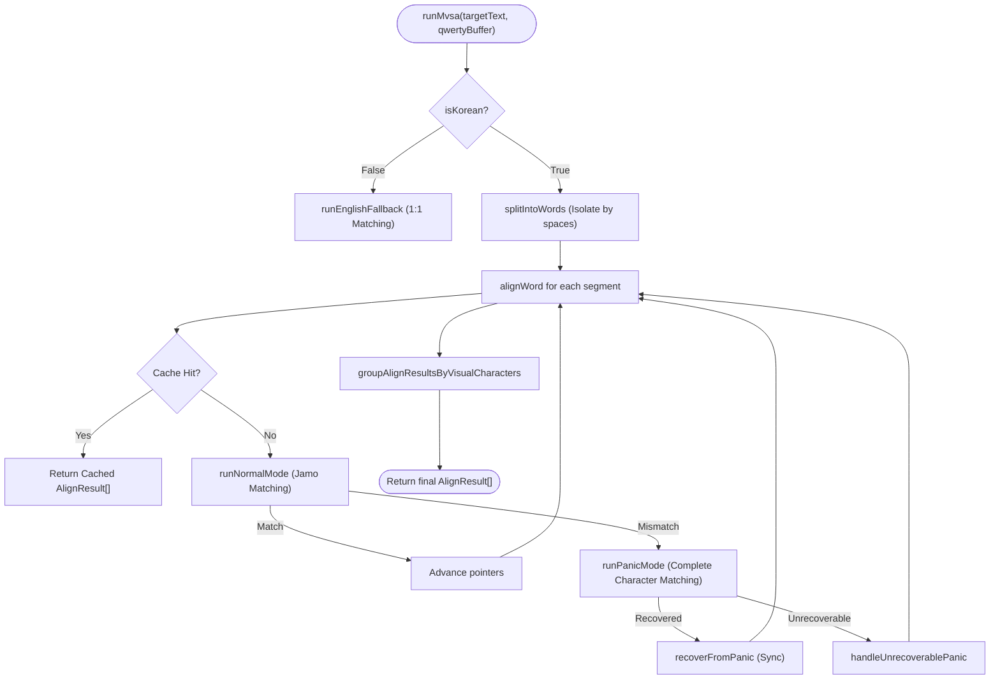

# MVSA (Maximum Valid Sequence Aligner) Algorithm Specification

## 1. Definition & Objective
The **MVSA (Maximum Valid Sequence Aligner)** is a heuristic state machine designed for real-time typing alignment in TypeDiag. It aligns a QWERTY physical key buffer against a target text string to accurately determine typos and incomplete states.

### Core Differentiators
1. **IME Composition State Handling**: Unlike general algorithms (e.g., LCS, Levenshtein) which misclassify intermediate Hangul composition states (e.g., treating the process of typing "한" as inserting "하"), MVSA performs matching at the *jamo* (phoneme) level.
2. **Carry-over Detection**: It robustly tracks Hangul's unique characteristic where a trailing consonant can carry over to become the leading consonant of the next character, maintaining synchronization without breaking the alignment flow.
3. **Bounded Lookahead for Typo Confinement**: In the event of a mismatch, MVSA restricts its lookahead search window to the number of completed characters, preventing local typos from incorrectly aligning with distant future text.
4. **Stateless & Deterministic**: The engine does not maintain internal history. It reconstructs the alignment purely from the `(targetText, qwertyBuffer)` pair. To prevent $\mathcal{O}(N^2)$ performance degradation on long texts, a **Word-Level Memoization Cache** is injected to yield $\mathcal{O}(1)$ performance for previously processed safe zones.

---

## 2. Architecture & File Mapping

- **Core Engine**: `src/utils/mvsa.ts` — Houses `MaximumValidSequenceAligner` and the `runMvsa` entry point.
- **Composition Utilities**: `src/utils/keyboardMap.ts` — `assembleHangulWithPunctuation`, `isCompleteHangul`.
- **Jamo Operations**: Uses `es-hangul` (`disassemble`, `assemble`, `convertQwertyToAlphabet`).
- **State Integration**: Injected into `src/store/typingSlices/createInputSlice.ts` for typing validation and UI rendering via `PracticePanel.tsx`.

---

## 3. Data Pipeline



### 3.1. Word Isolation (Safe Zone Partitioning)
- `targetText` is partitioned by spaces (`\s+`) into offset blocks `{ text, start }`.
- `qwertyBuffer` is analogously partitioned. This guarantees that typos in one word strictly cannot cascade and corrupt the alignment of subsequent words.

### 3.2. Caching Strategy
To maintain the functional statelessness without sacrificing performance:
- A unique cache key is generated: `${word.start}:${qPtr}:${wordQwerty}:${isCompleted}`.
- If the user backspaces across a word boundary, the joined string forms a new cache key, naturally invalidating the boundary state.
- Computation complexity per keystroke is functionally reduced to $\mathcal{O}(W)$ where $W$ is the length of the current word being typed.

---

## 4. Execution Modes

### 4.1. Normal Mode (Jamo-based Matching)
The algorithm disassembles the target character and compares it sequentially with the QWERTY input.
- **EQUAL**: The target's jamo sequence perfectly matches the buffer.
- **PARTIAL**: The buffer follows the correct jamo path but is incomplete (e.g., typing 'ㅎ' and 'ㅏ' for '하' when target is '한').

### 4.2. Panic Mode (Recovery Search)
Triggered upon a jamo mismatch. It transitions to matching by **completed visual characters** rather than individual jamo.

1. **Calculate Lookahead Window**:
   $$\text{maxLookahead} = \text{completeCharCount} + 1$$
   The search bound is strictly limited by how many complete characters the user has typed in the error buffer.
2. **Reverse Target Search**:
   For each completed character in the panic buffer, it scans the bounded target window *backwards* (Right-to-Left) to find the most recent synchronization point.
3. **Recovery Resolution (`recoverFromPanic`)**:
   - **Matched**: Intervening inputs are marked as `REPLACE` (or `INSERT` for excess), and skipped targets are marked as `OMIT`. Normal mode resumes from the sync point.
   - **Unmatched**: If no sync point is found, the remaining panic buffer is marked as `INSERT` or `REPLACE`, and remaining targets are marked as `PENDING`.

---

## 5. Visual Character Grouping

Since Hangul uses multiple physical keystrokes for a single visual character, jamo-level alignments are aggregated into visual blocks via `groupAlignResultsByVisualCharacters`.

**Operator Precedence**:
When collapsing jamo states into a single character state, the most severe operation dictates the final state:
$$\text{REPLACE (5)} > \text{INSERT (4)} > \text{PARTIAL (3)} > \text{EQUAL (2)} > \text{OMIT (1)} > \text{PENDING (0)}$$

**Carry-over Example (`가나다라` typed as `간다라`)**:
1. `rk` matches `가` (`EQUAL`).
2. `s` morphs `가` into `간`.
3. `e` triggers mismatch for `다` (Panic Mode).
4. `da` synchronizes with `다`.
5. The grouping collapses the skipped `나` to `OMIT`, rendering `간` as `PARTIAL` (since it contains the valid `가` plus an unexpected `ㄴ`), and `다라` as `EQUAL`.

---

## 6. Output Schema (`AlignResult`)

```typescript
export type AlignOp = "EQUAL" | "PARTIAL" | "REPLACE" | "INSERT" | "OMIT" | "PENDING";

export interface AlignResult {
  op: AlignOp;
  char: string;         // User's composed character (or mapped state)
  targetChar?: string;  // The ground truth character
  targetIndex?: number; // Absolute index in targetText
  inputIndex?: number;  // Absolute index in qwertyBuffer
}
```

### Operation Semantics & UI Mapping

| `op` | `char` | `targetChar` | Description | UI Rendering |
| :--- | :--- | :--- | :--- | :--- |
| **`EQUAL`** | Complete | Target | Perfectly matched character. | Default color |
| **`PARTIAL`**| Incomplete | Target | On the correct path, but unfinished. | Default color, cursor attached |
| **`REPLACE`**| Typo | Target | Incorrect character in the target's position. | Red font, warning background |
| **`INSERT`** | Extra | *None* | Keystrokes exceeding the target length. | Red font, warning background |
| **`OMIT`** | `""` | Target | Target character skipped by the user. | Red underline in empty space |
| **`PENDING`**| `""` | Target | Future characters waiting to be typed. | Faded grey font |

### Cursor Positioning Logic
The `inputIndex` dynamically drives the typing cursor in the UI.
- If the buffer is active, the cursor is placed immediately right of the element corresponding to the maximum `inputIndex`.
- This ensures the visual cursor perfectly follows the user's physical keystrokes, even during complex Hangul composition or error recovery states.
