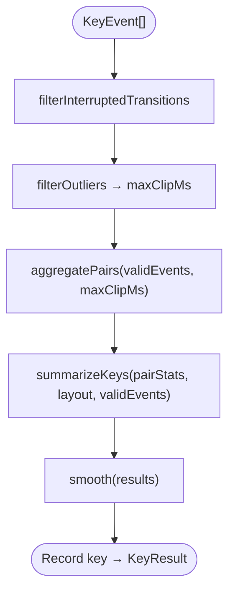

# SKDM (Spatial Keystroke Dynamics Model) 아키텍처

SKDM은 타건 이벤트 스트림 `{fromKey → toKey, latencyMs}`를 키보드 물리 좌표 위 3D 지연 지형으로 변환하는 수학 파이프라인입니다.

| 항목 | 정본 |
| :--- | :--- |
| TS 수학 모델 | `src/lib/skdm/model.ts` — `runPipeline` 및 단계별 함수 |
| 상수 | `src/lib/skdm/config.ts` |
| 타입 | `src/lib/skdm/types.ts` |
| 레이아웃 좌표 | `src/lib/skdm/layout.ts` — `buildLayout` |
| 통계 헬퍼 | `src/lib/skdm/stats.ts` — NumPy 호환 mean/median/std/percentile |
| 원통 좌표 | `src/lib/skdm/cylindrical.ts`, `src/lib/skdm/theta.ts`, `theta_order.json` |
| 키 메타 (손·손가락) | `src/lib/skdm/keyboardMeta.ts` |
| Cylindrical 통계·UI | [DIAGNOSTICS.md](DIAGNOSTICS.md) — `cylindricalStats/`, `useCylindricalDiagnostics` |
| Python 레거시 | `skdm/model.py`, `skdm/config.py`, `skdm/layout.py` |
| 패리티 검증 | `src/lib/skdm/model.parity.test.ts`, `__fixtures__/python-reference.json` |
| 이벤트 수집 | `src/store/typingSlices/createKeystrokeSlice.ts` |
| 키 입력 / 백스페이스 | `src/store/typingSlices/createInputSlice.ts`, `src/hooks/useWorkspaceKeybindings.ts` — 상세는 [STATE_MANAGEMENT.md](STATE_MANAGEMENT.md) |
| 진단 진입 | `src/hooks/useDiagnosticsTransition.ts` |
| Surface 3D | `src/components/workspace/Surface3DManager.ts`, `LatencySurface3D.tsx` |
| Cylindrical 3D | `src/components/workspace/CylindricalVector3D.tsx`, `geometryUtils.ts` |
| 2D 요약 패널 | `src/components/practice/ResultsPanel.tsx` |

### Cylindrical 용어 ([DIAGNOSTICS.md](DIAGNOSTICS.md)와 동기)

| 용어 | 식별 | SKDM에서의 사용 |
| :--- | :--- | :--- |
| **focusKey** | UI·API 인자 `focusKey` | 원통 뷰·진단 패널의 분석 초점 |
| **reference transition** | `toKey === focusKey` | `buildCylindricalVectors`, θ·r·z 집계 |
| **outgoing transition** | `fromKey === focusKey` | SKDM `runPipeline`과 무관 — [DIAGNOSTICS.md](DIAGNOSTICS.md) Cloud Typing 전용 |

---

## 1. 개요

진단 UI는 두 가지 뷰로 나뉩니다.

| 뷰 | `diagnosticMode` | 데이터 소스 | 역할 |
| :--- | :--- | :--- | :--- |
| **Global Latency Surface** | `"surface"` | `runPipeline` → `KeyResult.zSmoothed` + Delaunay `triangles` | 키보드 전체 지연 지형 (macro) |
| **Cylindrical Vector** | `"cylindrical"` | `buildCylindricalVectors(events, focusKey)` | focusKey로 **들어오는 reference transition** (micro) |

Tab 등으로 진단 모드에 들어가면 `useDiagnosticsTransition`이 이벤트를 모아 `runPipeline`을 실행하고, `useWorkspaceStore.setAnalysisData(results, triangles, events)`에 결과를 넣습니다.

---

## 2. 입력 데이터 (`KeyEvent`)

```typescript
export interface KeyEvent {
  fromKey: string | null;
  toKey: string;
  latencyMs: number;
  keyChar?: string;
  holdDurationMs?: number | null;
  isCorrect?: boolean | null;
  expectedChar?: string | null;
}
```

### 이벤트 기록 (`createKeystrokeSlice.recordKey`)

- 세션 첫 키: `{ fromKey: null, toKey: token, latencyMs: 0 }`
- 이후: `{ fromKey: lastKey, toKey: token, latencyMs: at - lastKeyAt }`
- `isCorrect`, `expectedChar`는 `createInputSlice`가 MVSA(`runMvsa`) 결과로 `recordKey`에 전달
- `holdDurationMs`는 **`number | null | undefined`**. `recordKey` 시 `null`, `handlePhysicalKeyRelease`에서 해당 `toKey`의 **마지막** 이벤트에 기록
  - 백스페이스 길게 누르기(repeat) 시: repeat마다 이벤트가 추가되고 중간 이벤트는 `null`, keyup 시 마지막 backspace 이벤트만 총 hold 시간을 받음
  - SKDM `runPipeline`은 `holdDurationMs`를 사용하지 않음
- Shift 단독 입력 후 릴리스 시 이벤트 스택 정리 로직 있음 (`shift_l` / `shift_r`)

### 진단 시 이벤트 소스 (`useDiagnosticsTransition`)

1. `currentRunId`가 있으면 DB에서 해당 run의 모든 page `key_events` 병합
2. 없거나 비어 있으면 `useTypingStore`의 `events` 배열 사용

---

## 3. 파이프라인 (`runPipeline`)

```typescript
export function runPipeline(
  events: KeyEvent[],
  layout: Record<string, KeyPosition>,
): Record<string, KeyResult>
```



### 3.1. `filterInterruptedTransitions`

Python `filter_backspaces`와 동일 로직. **스택 기반이 아님.**

각 이벤트에 대해:

- `isControlKey(k)`: `k.length > 1 && k !== "space"`
- `toKey` 또는 `fromKey`가 control key이면 **해당 전이 제외** (shift, backspace 토큰 등)
- `isCorrect === false`이면 **제외** (MVSA 오타)
- 그 외는 유지 — 백스페이스로 나중에 지워진 글자라도, 입력 당시 `isCorrect === true`이면 통계에 포함

### 3.2. `filterOutliers`

상수 (`config.ts`):

| 상수 | 값 |
| :--- | :--- |
| `OUTLIER_HARD_CUTOFF_MS` | 2000 |
| `OUTLIER_BLEND_START_EVENTS` | 50 |
| `OUTLIER_BLEND_END_EVENTS` | 1500 |
| `OUTLIER_IQR_MULTIPLIER` | 2.5 |
| `OUTLIER_IQR_MIN_UPPER_BOUND_MS` | 500 |

단계:

1. `latencyMs > 2000` 이벤트 제거
2. 남은 개수 `N < 50` → 상한 없이 통과, `maxClipMs` = 유효 이벤트 latency 최댓값 (없으면 2000)
3. `N ≥ 50` → `latencyMs > 0`만 log 변환 후 Q1, Q3, IQR 계산  
   `T_IQR = exp(Q3 + 2.5 × IQR)`, `T_dynamic = max(T_IQR, 500)`
4. 블렌딩:
   - `N ≥ 1500` → `finalUpperBound = T_dynamic`
   - `50 ≤ N < 1500` → `w = (N - 50) / (1500 - 50)`,  
     `finalUpperBound = (1 - w) × 2000 + w × T_dynamic`
5. `latencyMs > finalUpperBound` 제거
6. 반환: `[validEvents, maxClipMs]` — `maxClipMs`는 유효 이벤트 latency 최댓값 (없으면 `finalUpperBound`)

### 3.3. `sigmoidLatency` / `aggregatePairs`

클립 상한 `C = maxClipMs`:

- `t' = clamp(t, 0, C)`
- `t0 = 0.4 × C`, `D = C - t0`
- `steepness = D > 0 ? 4.6 / D : 0.02`
- `z(t) = 1 / (1 + exp(-steepness × (t' - t0)))`

`fromKey === null` 이벤트는 쌍 집계에서 제외.  
동일 `(fromKey, toKey)` 쌍의 `z` 값 산술 평균 → `PairStat { frequency, z }`.

### 3.4. `summarizeKeys`

레이아웃의 각 키(단, `EXCLUDE_ROWS`에 포함된 row 제외 — 기본값 row `0` 숫자열)에 대해:

**들어오는 쌍이 없을 때** (`toKey`로 들어오는 reference transition — [DIAGNOSTICS.md](DIAGNOSTICS.md) 용어)

- `z` = 세션 전체 pair `z`의 median (`sessionMedianZ`)
- `confidence` = 0
- `stdev` = 세션 키별 latency stdev의 median (`sessionMedianStdev`)

**들어오는 쌍이 있을 때**

- `z` = 빈도 가중 평균: `weight = frequency ** FREQUENCY_WEIGHT_POWER` (기본 `P = 1.0`)
- `confidence` = 들어오는 쌍(reference transition) frequency 합
- `stdev` = 해당 `toKey`로 들어온 raw `latencyMs`의 표준편차 (샘플 ≥ 2), 아니면 `sessionMedianStdev`

초기 `zSmoothed`, `stdevSmoothed`는 0 — `smooth`에서 채움.

### 3.5. `smooth` (Delaunay + Graph Laplacian)

- `keys.length < 3` → `zSmoothed = z`, `stdevSmoothed = stdev` 후 반환
- `triangulate(results)` → `d3-delaunay`로 `(x, y)` Delaunay, `buildAdjacency`로 이웃 그래프
- `normConf[i] = confidence[i] / max(confidence)` (max가 0이면 1로 나눔)
- `LAPLACIAN_ITERATIONS = 2` 회 반복:

```
alpha = LAPLACIAN_SMOOTHING_ALPHA * (1 - normConf[i])   // 기본 ALPHA = 0.2
if normConf[i] === 0: alpha = 0.8

z_new[i]     = (1 - alpha) * z[i]     + alpha * mean(z[neighbors])
stdev_new[i] = (1 - alpha) * stdev[i] + alpha * mean(stdev[neighbors])
```

결과를 `KeyResult.zSmoothed`, `stdevSmoothed`에 기록.

### 3.6. `triangulate`

`runPipeline` 밖에서도 호출됨 (`useDiagnosticsTransition`, `createSessionSlice`).  
Surface 메시 인덱스용 `Uint32Array` triangles 반환.

---

## 4. 키보드 레이아웃 (`buildLayout`)

`DEFAULT_ROWS`: 숫자열, qwerty, asdf, zxcv + `_dummy_comma` (쉼표 자리 더미 — Delaunay 경계용).

좌표:

- `x = colIdx × KEY_UNIT + ROW_STAGGER_U[row]`
- `y = (nRows - 1 - rowIdx) × ROW_HEIGHT_U` (숫자열이 위쪽 큰 y)

`ROW_STAGGER_U`: `{ 0: 0, 1: 0.5, 2: 0.75, 3: 1.25 }`

---

## 5. Cylindrical Vector 모델

### 5.1. `buildCylindricalVectors(events, focusKey, globalMax?)`

전처리: `filterInterruptedTransitions` → `filterOutliers` (Surface와 동일).

`toKey === focusKey`인 reference transition만 수집. `fromKey`는 `^[a-z]$`만 (소문자 알파벳).

`theta_order.json`의 `THETA_ORDER[focusKey]` 순서대로 벡터 생성:

| 축 | 의미 | 계산 |
| :--- | :--- | :--- |
| **θ** | fromKey 방위 | `getTheta(focusKey, fromKey)` → `(idx / 25) × 2π` |
| **r** | 전이 빈도 | 해당 reference transition 이벤트 수 |
| **z** | 평균 지연 | raw `latencyMs` 평균 (**sigmoid 미적용**) |

`globalMax`가 있으면:

- `normalizedR = r > 0 ? sqrt(r / maxR) : 0.15`
- `normalizedZ = z > 0 ? z / maxZ : 0.05`

`getGlobalCylindricalMax(events)`로 세션 전체 쌍의 max 빈도·max 평균 지연 계산.

`getAvailableFocusKeys(events)`: 전처리 후 `toKey`가 `^[a-z]$`인 focusKey 후보 목록.

진단 2D 패널·Cloud Typing·분절회귀는 SKDM 파이프라인과 **별도 레이어**입니다. 명세: [DIAGNOSTICS.md](DIAGNOSTICS.md).

### 5.2. 3D 배치 (`geometryUtils.toCylindricalCartesian`)

```
vx = normR × CYLINDRICAL_MAX_RADIUS × cos(θ)
vy = normZ × CYLINDRICAL_MAX_HEIGHT
vz = normR × CYLINDRICAL_MAX_RADIUS × sin(θ)
```

`CYLINDRICAL_MAX_RADIUS` / `CYLINDRICAL_MAX_HEIGHT` = 6.0

---

## 6. Global Latency Surface 시각화

### 6.1. 대상 키 (`IS_SURFACE_KEY`)

`geometryUtils.ts`: `^[a-z]$` 또는 `_dummy_comma`. 숫자열·모디파이어는 Surface 메시에서 제외.

### 6.2. `Surface3DManager.updateData`

입력: `keyStats` (`runPipeline` 결과).

**높이·색 (키 정점)**

1. `_dummy_comma` 제외한 키들의 `zSmoothed`로 `minZ`, `maxZ`, `zRange` 계산
2. `relativeZ = (zSmoothed - minZ) / zRange` (dummy는 0)
3. `amplifiedZ = relativeZ ** LATENCY_POWER` (`LATENCY_POWER = 1.3`)
4. Y 높이에 `amplifiedZ` 반영 (`get3DPos`)
5. HSL:
   - Hue: `227°` (빠름) → `345°` (느림), `amplifiedZ`에 비례
   - `normConf = sqrt(confidence / maxConfidence)`
   - Saturation: `0.2 + 0.8 × normConf`
   - Lightness: `0.25 + 0.35 × normConf`

**경계 정점**: inner/outer border는 `y = SURFACE_Y_OFFSET`, 고정 HSL `(227°, S=0.4, L=0.3)`.

**Drop-line**: 각 키 정점 색과 동일한 vertex color로 수직 가이드 라인.

### 6.3. `LatencySurface3D`

`Surface3DManager`를 `useThreeManager`로 마운트. `keyStats` 변경 시 `updateData` 호출.  
HUD 라벨 Y 오프셋은 `zSmoothed ** LATENCY_POWER`를 별도 사용 (메시 정점 높이 계산과 분리).

### 6.4. UI 흐름 (`DiagnosticsLayer`)

- 기본: `diagnosticMode === "surface"` → `LatencySurface3D`
- Surface에서 키 클릭 시 `diagnosticMode === "cylindrical"` → `CylindricalVector3D` (닫기 시 surface 복귀)

---

## 7. 출력 타입 (`KeyResult`)

```typescript
export interface KeyResult {
  key: string;
  row: number;
  x: number;
  y: number;
  z: number;              // sigmoid 스케일, 스무딩 전 대표 지연
  confidence: number;     // 들어오는 reference transition 빈도 합
  stdev: number;          // raw ms 표준편차
  zSmoothed: number;      // Laplacian 후 — Surface 높이·색의 기준
  stdevSmoothed: number;
}
```

`ResultsPanel`은 `zSmoothed` 내림차순으로 상위 5키 바 차트 표시.

---

## 8. Python 포트 및 테스트

TypeScript `model.ts`는 `skdm/model.py` 직접 포트. `stats.ts`는 NumPy percentile/median/std 의미를 맞춤.

| 테스트 파일 | 검증 내용 |
| :--- | :--- |
| `model.parity.test.ts` | `python-reference.json` fixture 대비 `runPipeline`·단계별 수치 일치 |
| `model.unit.test.ts` | `sigmoidLatency`, 필터, 집계 단위 |
| `pipeline.test.ts` | end-to-end `runPipeline` + `triangulate` |
| `cylindrical.test.ts` | `buildCylindricalVectors`, `getGlobalCylindricalMax` |
| `theta.test.ts` | `getTheta` |
| `useCylindricalDiagnostics.test.ts`, `cloudTyping.test.ts`, `burstNgram.test.ts`, `fatalNgram.test.ts` | Cylindrical Diagnostics·구름타법·n-gram |
| `stats.test.ts` | percentile/median/std |

---

## 9. MVSA와의 관계

- MVSA(`runMvsa`) → 키 입력 시 `isCorrect` / `expectedChar` 판정
- SKDM `filterInterruptedTransitions` → `isCorrect === false` 전이를 지연 통계에서 제거
- 오타 구간은 3D 지형에 반영되지 않고, 정상 타이핑 리듬만 집계됨
