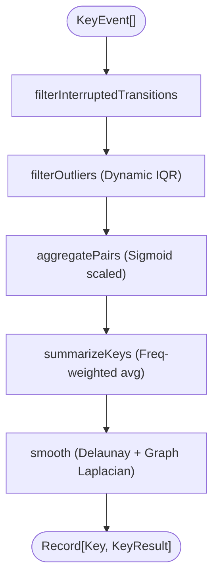

# SKDM (Spatial Keystroke Dynamics Model) Architecture

The SKDM pipeline transforms raw keystroke event streams `{fromKey → toKey, latencyMs}` into a 3D physical latency topology mapping over the keyboard layout.

## 1. Directory & Code Mapping

| Component | Path / Implementation |
| :--- | :--- |
| **Pipeline Core** | `src/lib/skdm/model.ts` (`runPipeline`, `filterOutliers`, `smooth`) |
| **Constants** | `src/lib/skdm/config.ts` |
| **Type Definitions**| `src/lib/skdm/types.ts` |
| **Layout Math** | `src/lib/skdm/layout.ts` (`buildLayout`) |
| **Cylindrical 3D** | `src/lib/skdm/cylindrical.ts`, `theta.ts` |
| **Stats Utilities** | `src/lib/skdm/stats.ts` (NumPy compatible math) |
| **UI Consumers** | `Surface3DManager.ts`, `LatencySurface3D.tsx`, `CylindricalDiagnosticsPanel.tsx` |

### Cylindrical Terminology (Synced with DIAGNOSTICS)
| Term | Definition | Role in SKDM |
| :--- | :--- | :--- |
| **focusKey** | The target key being analyzed. | Pivot for Cylindrical vector aggregation. |
| **reference transition**| Transition where `toKey === focusKey`. | Used for building cylindrical vectors (θ, r, z). |
| **outgoing transition** | Transition where `fromKey === focusKey`. | **Not used** in base SKDM pipeline (only in Diagnostics Cloud Typing). |

---

## 2. Input Data Model (`KeyEvent`)

```typescript
export interface KeyEvent {
  fromKey: string | null;
  toKey: string;
  latencyMs: number;
  holdDurationMs?: number | null;
  isCorrect?: boolean | null;
  expectedChar?: string | null;
}
```

- **Hold Duration**: Processed on `keyup`. For repeated backspaces, only the final release receives the total duration. (SKDM core ignores hold; it's used by Cloud Typing).
- **Correctness**: Enriched via MVSA integration.

---

## 3. Data Pipeline (`runPipeline`)



### 3.1. `filterInterruptedTransitions`
Drops transitions where either key is a control key (excluding space) or where `isCorrect === false`. It relies on boolean evaluation rather than a manual stack, preserving valid typing stretches even if they are later deleted by backspaces.

### 3.2. `filterOutliers`
Filters extreme outlier latencies to maintain model integrity:
1. **Hard Cutoff**: Immediately discards latency > 2000ms.
2. **Dynamic Log-IQR**: For `N >= 50` events, computes $Q_1$, $Q_3$, and $IQR$ over $\log(\text{latency})$.
   $$T_{\text{IQR}} = \exp(Q_3 + 2.5 \times IQR)$$
   $$T_{\text{dynamic}} = \max(T_{\text{IQR}}, 500)$$
3. **Blend Interpolation**: If $50 \leq N < 1500$, the threshold is linearly blended between the hard cutoff (2000ms) and $T_{\text{dynamic}}$.
4. Returns the bounded events and the `maxClipMs`.

### 3.3. `sigmoidLatency` & `aggregatePairs`
Latency values are clamped to `maxClipMs` and squashed via a sigmoid function to reduce sensitivity to minor fast fluctuations while accentuating problematic slow transitions.
Transitions are grouped by `(fromKey, toKey)` to calculate mean sigmoids and frequencies.

### 3.4. `summarizeKeys`
Aggregates all **incoming** pairs (`reference transitions` where `toKey === targetKey`) into a single representative score per key:
- **Z-Score**: Frequency-weighted average of incoming pairs ($weight = frequency^{1.0}$).
- **Confidence**: Total sum of incoming pair frequencies.
- Keys with 0 incoming transitions fall back to the session median values with 0 confidence.

### 3.5. `smooth` (Delaunay & Graph Laplacian)
Resolves spatial gaps and uncertainties across the physical layout.
1. Computes a **Delaunay Triangulation** of the physical key coordinates to build an adjacency graph.
2. Applies **Graph Laplacian Smoothing** iteratively (default: 2 iterations).
3. Smoothing factor $\alpha$ is inversely proportional to normalized confidence:
   $$\alpha_i = 0.2 \times (1 - \text{normConf}_i)$$
   Low-confidence keys ($\alpha = 0.8$) strongly adopt the average latency of their neighbors, filling holes in the 3D surface.

---

## 4. Keyboard Layout Logic (`buildLayout`)

Converts the staggered QWERTY arrangement into a Cartesian grid:
- $X = \text{colIdx} \times 1.0 + \text{rowStagger}$
- $Y = (nRows - 1 - \text{rowIdx}) \times 1.0$ (Flipped so top row has largest Y)
- Dummy keys (e.g., `_dummy_comma`) are inserted to enforce a clean rectangular Delaunay boundary, though they are visually excluded in 3D.

---

## 5. Cylindrical Vector Model

While `runPipeline` creates the macro 3D surface, `buildCylindricalVectors` constructs the micro-view for a specific `focusKey`.

### Execution Flow (`buildCylindricalVectors`)
1. Pre-processes events using `filterInterruptedTransitions` and `filterOutliers`.
2. Isolates **reference transitions** (`toKey === focusKey`) where `fromKey` is a lowercase alphabet.
3. Iterates over predefined angles from `theta_order.json`.

### Vector Mathematics
For each `fromKey` transitioning to the `focusKey`:
- **$\theta$ (Theta)**: Predefined compass direction mapped to radians (0 to $2\pi$).
- **$r$ (Radius)**: Total transition count (frequency).
- **$z$ (Height)**: Arithmetic mean of raw latency in milliseconds (no sigmoid applied).

When `globalMax` is provided:
- $r_{\text{norm}} = \sqrt{r / \max(R)}$ (Square root scaling ensures low frequencies remain visible).
- $z_{\text{norm}} = z / \max(Z)$.
- Converts to 3D space: $x = r_{\text{norm}} \cdot R_{\text{max}} \cdot \cos(\theta)$, etc.

---

## 6. Output Schema (`KeyResult`)

```typescript
export interface KeyResult {
  key: string;
  row: number;
  x: number;
  y: number;
  z: number;              // Raw representative sigmoid latency
  confidence: number;     // Sum of incoming transition frequencies
  stdev: number;          // Raw ms standard deviation
  zSmoothed: number;      // Post-Laplacian height (Drives 3D Y-axis & color)
  stdevSmoothed: number;  // Post-Laplacian stdev
}
```
`zSmoothed` ultimately determines the 3D topology height and color interpolation (Fast Cyan to Slow Cyan).
