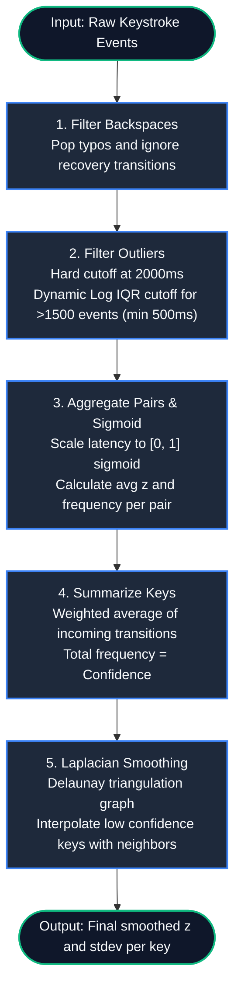

# Spatial Keystroke Dynamics Model (SKDM) Architecture

This document describes the Spatial Keystroke Dynamics Model (SKDM), which visualizes and analyzes typing habits and latency in a 3D space.

## 1. System Overview

The model is divided into two primary visualizations:
1. **Key-Centric Vector Model (Cylindrical)**: A flower-like shape representing incoming keystrokes for a specific key.
2. **Global Latency Surface**: A 3D topographical map representing the overall typing speed and bottlenecks across the entire keyboard.

### Core Data Flow
Every keystroke generates an event: `{From Key, To Key, Latency (ms)}`.
These events are aggregated and transformed when the user enters "Diagnostics Mode" (e.g., by pressing Tab).

---

## 2. Data Processing Pipeline

### Pipeline Steps:

1. **Backspace Filtering (Interrupted Transition Filter)**:
   Removes typos and correction transitions. We run a stack-based filter over the raw key events:
   * **State Machine**:
     * Iterate through each event `(fKey, sKey)`.
     * If `sKey` is a backspace, pop the top of the stack (deleting the last valid input).
     * If `fKey` is a backspace or a control key (e.g., `Shift`, `Ctrl` - length $> 1$ except `space`), or if `sKey` is a control key, push `[sKey, null]` to the stack to break the transition chain.
     * Otherwise, push `[sKey, event]` to the stack.
   * Finally, we filter the stack to collect only the non-null events. This ensures that typing recovery pauses and command keys do not skew typing speed statistics.

2. **Outlier Filtering & Blending**:
   Eliminates pauses or long delays using a hybrid threshold. Let $N$ be the number of events after hard-filtering:
   * **Hard Cutoff**: Discard any event with latency $> 2000 \text{ ms}$.
   * **Dynamic Threshold (Log-IQR)**:
     If $N \ge 50$ (start event threshold), compute the log-transformed latencies $L = \ln(\text{latencies})$. Let $Q_1$ and $Q_3$ be the 25th and 75th percentiles of $L$:
     \[ \text{IQR} = Q_3 - Q_1 \]
     \[ T_{\text{IQR}} = e^{Q_3 + 1.5 \times \text{IQR}} \]
     We apply a minimum bound guard: $T_{\text{dynamic}} = \max(T_{\text{IQR}}, 500 \text{ ms})$.
   * **Transition Blending**:
     To avoid threshold jumps as data grows, we blend the bounds linearly between $50$ and $1500$ events:
     \[
     w = \frac{N - 50}{1500 - 50}
     \]
     \[
     T_{\text{final}} = (1 - w) \times 2000 \text{ ms} + w \times T_{\text{dynamic}} \quad (\text{for } 50 \le N < 1500)
     \]
     If $N \ge 1500$, $T_{\text{final}} = T_{\text{dynamic}}$.

3. **Pair Aggregation & Sigmoid Scaling**:
   Calculates the average sigmoid latency for each physical key pair $(FromKey \to ToKey)$.
   * **Sigmoid Formula**:
     For a latency value $t$ (ms) and the upper bound limit $C = T_{\text{final}}$:
     First, clamp $t$ to $t' = \max(0, \min(C, t))$.
     Let the curve center be $t_0 = 0.4 \times C$, and the steepness denominator be $D = C - t_0$. The scaling factor $s$ is:
     \[
     s = \begin{cases} 
     \frac{4.6}{D} & \text{if } D > 0 \\
     0.02 & \text{otherwise}
     \end{cases}
     \]
     The sigmoid value $z(t) \in [0, 1]$ is computed as:
     \[
     z(t) = \frac{1}{1 + e^{-s(t' - t_0)}}
     \]
   * For each distinct key pair, we calculate the arithmetic mean of $z(t)$ across all occurrences.

4. **Key Summarization**:
   Aggregates incoming transitions to form a representative latency $Z_i$ for key $i$.
   Let $S(i)$ be the set of incoming transitions targeting key $i$. The summary $z_i$ is a frequency-weighted average:
   \[
   z_i = \frac{\sum_{s \in S(i)} w_s \cdot z_s}{\sum_{s \in S(i)} w_s} \quad \text{where } w_s = (\text{frequency}_s)^P
   \]
   By default, $P = 1.0$. The total raw frequency $\sum \text{frequency}_s$ represents the **confidence** $c_i$ of that key's statistics.

5. **Laplacian Smoothing**:
   Propagates latency to neighbors and fills in keys with low confidence.
   * **Delaunay Graph**: We build an undirected graph $G = (V, E)$ based on the 2D physical keyboard layout coordinates $(x, y)$.
   * **Confidence Weighting**: Let $\tilde{c}_i = c_i / \max_{j \in V}(c_j)$ be the normalized confidence. The smoothing factor $\alpha_i$ is defined as:
     \[
     \alpha_i = \begin{cases}
     0.8 & \text{if } \tilde{c}_i = 0 \\
     0.2 \times (1.0 - \tilde{c}_i) & \text{otherwise}
     \end{cases}
     \]
   * **Smoothing Iterations**: Over $K = 2$ iterations, we update the smoothed values $z_i^{(k)}$ and standard deviations $\sigma_i^{(k)}$ using the mean of the neighbor keys $N(i)$:
     \[
     z_i^{(k)} = (1.0 - \alpha_i) z_i^{(k-1)} + \alpha_i \left( \frac{1}{|N(i)|} \sum_{j \in N(i)} z_j^{(k-1)} \right)
     \]
     \[
     \sigma_i^{(k)} = (1.0 - \alpha_i) \sigma_i^{(k-1)} + \alpha_i \left( \frac{1}{|N(i)|} \sum_{j \in N(i)} \sigma_j^{(k-1)} \right)
     \]

---

## 3. Key-Centric Vector Model (Cylindrical)

### Concept
Visualizes the relationship between a specific target key (**To Key**) and all keys pressed immediately before it (**From Keys**).

Each key has an independent 3D cylindrical coordinate system:
* **Origin**: The target key (To Key).
* **Vector $\vec{V}_{k} = (r, \theta, z)$**:
  * **$\theta$ (Direction)**: The identity of the From Key, spaced uniformly over 360°.
  * **$z$ (Height)**: The raw average latency (in ms, no sigmoid applied) of the transition.
  * **$r$ (Radius)**: The frequency of this specific key transition.

### UI Interaction
When a user clicks a key in Diagnostics Mode, the view morphs into this fan-like "flower" shape. It helps diagnose *why* a key is slow by highlighting specific incoming transitions that are causing bottlenecks.

---

## 4. Global Latency Surface

### Concept
A 3D topographical map constructed by compressing the vector data of all keys into single representative points and connecting them.

### Visual Representation
* **Flat plains**: Fast, consistent typing areas.
* **High peaks**: Areas where typing is slow or the user hesitates.
* **Uneven terrain**: Inconsistent typing rhythm.

### UI Interaction
This is the default view in Diagnostics Mode. It provides a macro-level overview of the user's typing bottlenecks before they drill down into specific keys using the Cylindrical view.
