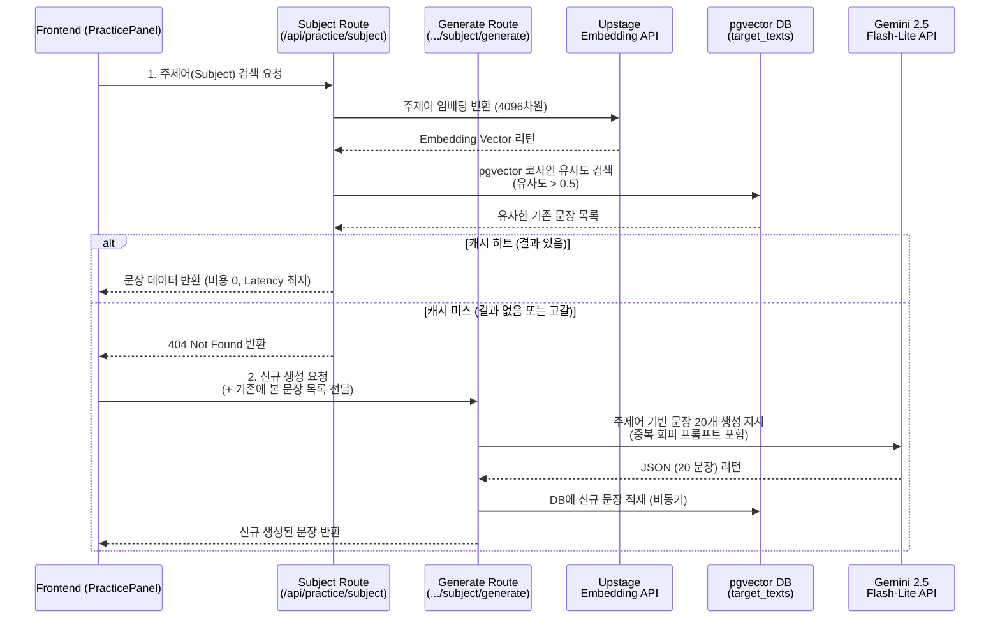

# TypeDiag: Subject Mode 아키텍처 및 벡터 캐싱 명세서

Subject Mode(주제 모드)는 사용자가 직접 입력한 주제어에 맞는 타자 연습 문장을 실시간으로 서빙하는 모드입니다. LLM API 호출로 인한 비용 부담을 낮추고 빠른 응답 속도를 확보하기 위해 **의미론적 캐싱(Semantic Caching)** 및 **벡터 유사도 검색** 기반의 하이브리드 아키텍처를 채택했습니다.

---

## 1. 아키텍처 및 데이터 흐름 (Architecture & Data Flow)

Subject 모드의 백엔드는 철저히 2단계로 분리되어 구동됩니다:
1. `api/practice/subject/route.ts` : 벡터 캐싱 기반 고속 검색
2. `api/practice/subject/generate/route.ts` : LLM 기반 실시간 문장 생성

---

## 2. 세부 파이프라인 명세

### 2.1. 벡터 검색 파이프라인 (Vector Search)
- **임베딩 모델**: Upstage `embedding-query` (차원 수: 4096)
- **저장소 인덱싱**: PostgreSQL `pgvector` 인덱스.
- **유사도 판단 기준**: `1 - (target_texts.embedding <=> vectorLiteral) > 0.5`
  - 코사인 유사도가 0.5를 초과하는 문장만 `Hit`로 간주합니다. 이 임계값은 성능과 정합성 간의 트레이드오프에 따라 보수적으로 설정되었습니다.
- **최대 반환 결과**: 캐시 히트 시 최대 상위 100개 문장을 로드하여 클라이언트 메모리 풀(Pool)에 보관합니다.

### 2.2. 문장 생성 파이프라인 (LLM Generation)
- **저가 LLM API**: Gemini 2.5 Flash-Lite
- **문장 제약 조건**: 순수 한글 60~100자 (공백·문장부호 제외). 타자 연습을 위해 단순 구문보다는 두 개 이상의 절이 연결된 복문/중문 생성을 유도합니다.
- **중복 생성 회피 (Deduplication)**: 클라이언트가 이미 타건한(혹은 버퍼에 있는) 문장 배열(`existingSentences`)을 넘겨주면, Gemini 프롬프트 내에 해당 문장들과 유사한 문장을 생성하지 않도록 강제(CRITICAL 지시)합니다.

### 2.3. 클라이언트 상태 관리 및 페이징 (Client Pagination)
사용자가 연습을 진행하며 문장을 소모할 때, 끊김 없는 UX를 제공하기 위해 다음과 같은 로직이 구동됩니다.
- Zustand `useSubjectTargets` 훅에서 초기 로딩된 문장 큐를 관리합니다.
- 사용자가 문장 큐의 끝에 다가가면(예: 남은 문장 수가 N개 이하), 백그라운드에서 `fetchMoreSubjectTargets`를 호출하여 새로운 문장을 선제적으로 요청합니다.
- 이때 기존 DB 캐시가 고갈되었을 경우 자연스럽게 LLM `generate` 라우트로 폴백(Fallback)되어 무한 스크롤 형태의 연습이 가능해집니다.

---

## 3. 에러 핸들링 및 예외 처리 (Exception Handling)

- **주제어 검증 필터 (Validation Filter)**: 
  - 임베딩 생성 및 API 호출 전, 의미 없는 비정상 입력(예: "ㄱㄱㄱㄱㄱ", "asdfasdf") 혹은 과도하게 긴 주제어는 `validateSubject` 함수를 통해 차단하여 불필요한 API 비용 소모를 방지합니다.
- **로딩 피드백 (Interactive Loading)**: 
  - 캐시 미스로 인해 Gemini API를 호출하여 지연이 발생할 경우(약 1~2초 내외), 프론트엔드에서 인터랙티브 로딩 애니메이션을 즉시 표시하여 사용자 경험의 끊김을 방지합니다.
- **Max Tokens 예외**: 
  - Gemini 응답이 도중에 잘리더라도 정상 파싱 가능한 문장만 필터링하여 시스템 중단을 막습니다.
