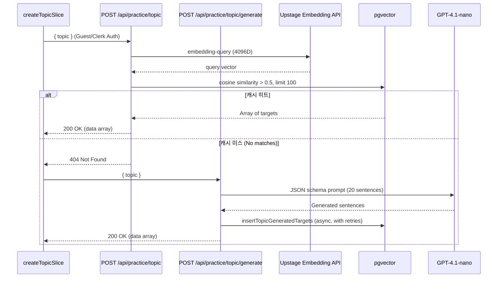

# TypeDiag: Topic Mode 아키텍처 및 벡터 캐싱 명세서

Topic Mode(주제 모드)는 사용자가 직접 입력한 주제어에 맞는 타자 연습 문장을 실시간으로 서빙하는 모드입니다. LLM API 호출 비용을 줄이고 응답 속도를 높이기 위해 **의미론적 캐싱(Semantic Caching)** 및 **벡터 유사도 검색**을 결합한 하이브리드 아키텍처를 사용합니다.

- **정본 소스**: `src/app/api/practice/topic/`, `src/store/typingSlices/createTopicSlice.ts`, `src/lib/api/topicGenerateOpenAI.ts`

---

## 1. 아키텍처 및 데이터 흐름

Topic 백엔드는 2단계 API 구조로 분리되어 동작합니다:

1. **캐시 검색 (`POST /api/practice/topic`)**: pgvector를 이용한 유사도 캐시 히트 확인
2. **실시간 생성 (`POST /api/practice/topic/generate`)**: 캐시 미스 시 OpenAI를 이용한 실시간 문장 생성



> **인증 및 유저 식별**: API는 Clerk 로그인 유저 및 비로그인 게스트(Guest User) 모두 지원합니다. 인증은 `resolveApiUser(req)`를 통해 이루어집니다.

---

## 2. 세부 파이프라인 명세

### 2.1. 벡터 검색 파이프라인 (`/api/practice/topic`)
- **Rate Limit (비용/어뷰징 방지)**: 일일 검색 최대 **100회** 제한 (`checkTopicRateLimit`) 초과 시 429 반환.
- **임베딩 모델**: Upstage `embedding-query` (4096차원 벡터). 환경 변수: `UPSTAGE_API_KEY`.
- **유사도 쿼리**: `1 - (targetTexts.embedding <=> vectorLiteral) > 0.5`
- **반환 상한**: `.limit(100)` – Drizzle DB 쿼리를 통한 결과 제한.
- **클라이언트 핸들링**: 404 응답 시 자동으로 생성 파이프라인으로 Fallback 호출.

### 2.2. 문장 생성 파이프라인 (`/api/practice/topic/generate`)
- **Rate Limit**: 일일 생성 최대 **15회** 제한 (`checkTopicRateLimit`) 초과 시 429 반환.
- **LLM**: OpenAI `gpt-4.1-nano` 모델. 환경 변수: `OPENAI_API_KEY`.
- **요청 파라미터**: 고정된 20개 문장 배열을 강제하기 위해 `response_format.json_schema` 적용. `max_tokens: 8192`.
- **백엔드 재시도 로직 (`topicGenerateOpenAI.ts`)**: 
  - 429, 503 상태 및 응답 잘림(`finish_reason === "length"`) 발생 시 최대 4회 재시도.
  - Backoff Delay: 2.5초, 5초, 8초, 12초.
- **후처리 및 필터링**: `filterTopicGeneratedSentences`를 통해 유효한 길이(60~100자) 및 형식을 갖춘 한글 문장만 필터링.
- **DB 비동기 적재**: 생성된 타겟은 `insertTopicGeneratedTargets`를 통해 캐시 DB에 저장됨. (실패 시 500ms, 1500ms 2회 재시도). ID 체계: `target_gen_<uuid>`.
- **중복 완화**: 캐싱 메커니즘과 함께 클라이언트 내 단일 풀(`topicTargets`)을 100개로 상한선 관리하여 중복 호출 최소화.

---

## 3. 클라이언트 상태 관리 (`createTopicSlice.ts`)

Zustand Store(`InputSlice`) 내부에 통합된 Topic 전용 상태 및 액션입니다.

| 주요 상태 (State) | 설명 |
| :--- | :--- |
| `topicTargets` | 검색 및 생성된 문장 배열 (최대 100개 유지) |
| `topicTargetIndex` | 현재 타겟의 인덱스 위치 |
| `isTopicLoading` | 벡터 검색 중 상태 (Search API 호출 중) |
| `isTopicGenerating` | 문장 생성 중 상태 (Generate API 호출 중) |
| `isTopicWaitingForGenerate` | 남은 문장이 없어 생성 응답을 블로킹하며 대기하는 상태 |

| 주요 액션 (Action) | 설명 |
| :--- | :--- |
| **`fetchTopicTarget(topic)`** | 입력된 주제어로 API 요청 시작. Validation → Search API → (404시) Generate API 순차 진행. |
| **`requestMoreTopicTargets(topic)`** | 백그라운드 풀 보충. 남은 문장(`remainingCount`)이 3개 이하일 때 Generate API를 호출하여 풀에 추가. |
| **`topicNextTarget()`** | 다음 문장으로 이동. 필요 시 `requestMoreTopicTargets`를 호출하며, 남은 문장이 0개일 경우 대기 상태 진입. |
| **`handleTopicInputKeyPress`** | 주제어 입력 폼 키보드 이벤트 처리 및 실시간 MVSA(초성/중성/종성) 연동 지원. |

---

## 4. 에러 핸들링 및 예외 처리

- **클라이언트 검증**: API 호출 전 `validateTopic`으로 무의미한 입력이나 과도한 길이를 사전 차단.
- **LLM 응답 잘림 (Truncation)**: OpenAI 응답 토큰이 잘려 문장 생성을 파싱할 수 없는 경우, 재시도 가능한 503 예외(`TOPIC_GENERATE_TRUNCATED_ERROR`)로 간주.
- **Rate Limit 도달**: `checkTopicRateLimit`에 의해 클라이언트에 429 응답 시, 유저에게 할당량 초과 안내.
- **상태 복구**: 치명적 오류 또는 생성 실패 시 `topicGenerateError` 상태가 할당되며 안내 오버레이가 표시되고, 일정 시간 뒤 다시 주제 입력 뷰(`resetTopicToGuideScreen`)로 복귀함.

---

## 5. 로컬 개발 환경 요구사항

Topic Mode를 정상 작동시키기 위해 pgvector 확장이 활성화된 DB 환경이 필요합니다:

```bash
npm run db:up
npm run db:push
npm run db:seed  # 필수 초기 데이터 및 pgvector 설정
```

`.env.local` 파일에 다음 환경 변수가 설정되어야 합니다:
- `UPSTAGE_API_KEY` (벡터 임베딩용)
- `OPENAI_API_KEY` (문장 생성용)
