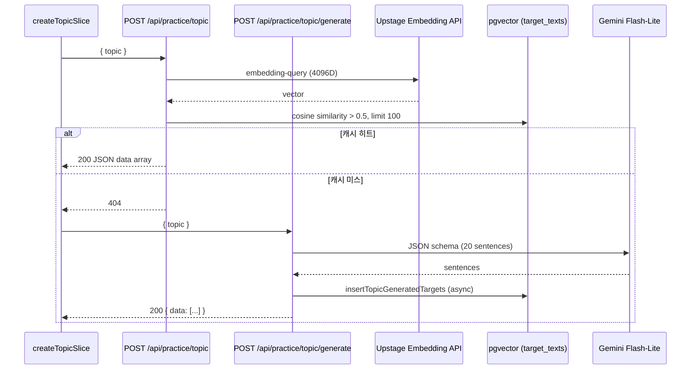

# TypeDiag: Topic Mode 아키텍처 및 벡터 캐싱 명세서

Topic Mode(주제 모드)는 사용자가 직접 입력한 주제어에 맞는 타자 연습 문장을 실시간으로 서빙하는 모드입니다. LLM API 호출 비용을 줄이고 응답 속도를 높이기 위해 **의미론적 캐싱(Semantic Caching)** 및 **벡터 유사도 검색** 하이브리드 아키텍처를 사용합니다.

정본: `src/app/api/practice/topic/`, `src/store/typingSlices/createTopicSlice.ts`, `src/lib/api/parseTopicRequest.ts`

---

## 1. 아키텍처 및 데이터 흐름

Topic 백엔드는 2단계로 분리됩니다:

1. `src/app/api/practice/topic/route.ts` — 벡터 캐싱 기반 검색
2. `src/app/api/practice/topic/generate/route.ts` — LLM 실시간 생성



> Topic API는 현재 **무인증**입니다. API 계약·상태 코드는 [API.md](API.md) 참고.

---

## 2. 세부 파이프라인 명세

### 2.1. 벡터 검색 파이프라인

- **임베딩 모델**: Upstage `embedding-query` (4096차원)
- **환경 변수**: `UPSTAGE_API_KEY`
- **유사도**: `1 - (embedding <=> queryVector) > 0.5`
- **반환 상한**: `.limit(100)` — Drizzle 쿼리 SSOT
- **요청 검증**: `parseTopicRequest` → `validateTopic()` (`src/utils/validation.ts`)

### 2.2. 문장 생성 파이프라인

- **LLM**: `gemini-2.5-flash-lite`, 실패 시 `gemini-2.0-flash-lite` 폴백
- **환경 변수**: `GEMINI_API_KEY`
- **프롬프트**: `src/lib/practice/prompts.json`
- **응답 스키마**: JSON `sentences` 배열 20개 (`responseSchema` 강제)
- **후처리**: `filterTopicGeneratedSentences` — 순수 한글 60~100자(공백·문장부호 제외) 등 형식 필터
- **DB 적재**: `target_gen_<uuid>` ID로 `insertTopicGeneratedTargets` (재시도 2회)
- **중복 완화**: 벡터 캐시 재사용·DB 적재·클라이언트 풀 상한(100).

### 2.3. 클라이언트 상태 관리 (`createTopicSlice.ts`)

Zustand InputSlice에 병합된 topic 전용 상태·액션:

| 상태/액션 | 설명 |
| :--- | :--- |
| `topicTargets` | 검색/생성된 문장 풀 (최대 100) |
| `fetchTopicTarget` | 주제 검색 → 404 시 generate 폴백 |
| `requestMoreTopicTargets` | 풀 보충 (generate만 호출, `{ topic }`) |
| `topicNextTarget` | 다음 문장; `remainingCount <= 3`이면 prefetch |
| `handleTopicInputKeyPress` | 주제어 입력 (Enter = 검색) |

초기 fetch 후 `data.length < 3`이면 즉시 `requestMoreTopicTargets` 호출.

상세 slice 연동: [STATE_MANAGEMENT.md](STATE_MANAGEMENT.md) §1.5

---

## 3. 에러 핸들링

- **주제어 검증**: `validateTopic` — 무의미 입력·과도한 길이 차단 (API 400)
- **로딩 UI**: `isTopicLoading` / `isTopicGenerating` 플래그로 PracticePanel 피드백
- **Gemini 잘림**: `filterTopicGeneratedSentences`로 파싱 가능한 문장만 반환; 전부 실패 시 422
- **Gemini 429/503**: 모델·재시도 후 503 + 사용자 메시지

---

## 4. 로컬 개발 요구사항

Topic Mode를 사용하려면:

```bash
npm run db:up && npm run db:push && npm run db:seed   # pgvector extension
```

`.env.local`에 `UPSTAGE_API_KEY`, `GEMINI_API_KEY` 설정 ([README](../README.md) 참고).
