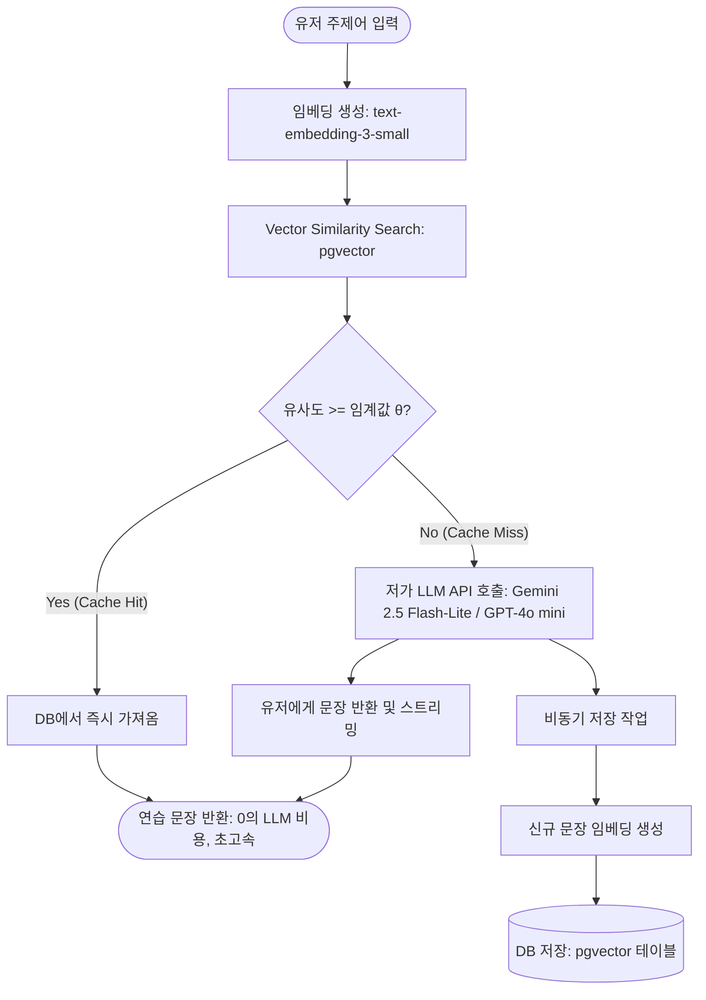

# TypeDiag: 타자 연습 모드 & Hardcore MLP 명세서

이 문서는 **TypeDiag**의 연습 모드 구성과 특히 **하드코어 모드 (Hardcore Mode)**에서 사용자의 오타 취약 자모 조합을 강제 유도하기 위해 구동하는 **MLP Language Model(다층 퍼셉트론 언어 모델)**의 기술적 로직을 정리한 명세서입니다.

---

## 1. 타자 연습 모드 개요 (Brief Overview)

TypeDiag는 사용자의 목적에 맞게 4가지 연습 모드를 지원합니다.

*   **Default Mode**: 기본 고정 예문 리스트(`targets.json`) 연습.
*   **Subject Mode**: 유저 입력 주제어에 맞춰 임베딩 벡터 검색(`pgvector`)을 수행하여 매칭되는 기존 텍스트를 캐시 히트로 서빙하거나, 캐시 미스 시 저비용 LLM API로 실시간 생성하는 하이브리드 연습 모드 (네트워크 대기 중 로딩 애니메이션 제공).
*   **Plain Mode**: 가이드라인 텍스트가 없는 메모장 형태의 자유 입력 모드.
*   **Hardcore Mode**: 오타와 지연시간 분석을 결합하여, 사용자가 치기 힘든 취약 키/희귀 전이 문자열을 강제 연습시키는 핵심 훈련 모드.

---

## 2. Hardcore MLP Language Model 기술 명세

하드코어 모드의 핵심은 **"한글 조합 정합성을 100% 만족하면서도, 사용자가 가장 오타를 잘 내고 리듬이 지연되는 희귀 자모 순서쌍(Rare Sequence)을 생성해 내는 것"**입니다.

### 2.1. 웹 브라우저 구동 제약 극복 방안 (Pre-trained + Blending)
웹 브라우저의 한계로 인해 수만 건의 훈련 데이터를 클라이언트 측에서 실시간 Backpropagation(역전파)으로 학습시키는 것은 불가능합니다. 

따라서 **오프라인 환경에서 대용량 한국어 말뭉치로 사전 학습된 가중치 JSON(`hardcore_weights.json`)을 서빙**하고, 브라우저 상에서는 추론 시점에 **사용자의 실시간 취약 키 점수를 로짓 레벨에서 블렌딩(Blending)** 하는 대안 설계를 채택했습니다.

---

### 2.2. MLP 신경망 아키텍처 및 순전파 (Forward Pass)

추론의 안정성을 확보하기 위해, 입력 윈도우 크기는 동일하게 **직전 6글자(Context = 6)**로 한정합니다.

```
[직전 6개 글자 ID] ──► Embedding Lookup ──► Flatten (96차원)
                                              │
                                              ▼
                                      Hidden Layer (64차원, ReLU)
                                              │
                                              ▼
                                      Output Logits (V차원 어휘사전 크기)
```

1.  **임베딩 테이블 조회 (Embedding Lookup)**:
    입력된 6글자 ID 각각을 $16$차원의 조밀 벡터로 변환합니다.
2.  **직렬화 (Flatten)**:
    6개의 임베딩 벡터를 일렬로 이어 붙여 **$96$차원(6 $\times$ 16)의 1차원 입력 벡터 $\mathbf{x}$**를 형성합니다.
3.  **은닉층 연산 (Hidden Layer with ReLU)**:
    가중치 $\mathbf{W}_1$과 편향 $\mathbf{b}_1$을 연산한 뒤, 음수 값을 0으로 깎는 ReLU 활성화 함수를 통과시켜 64차원 벡터 $\mathbf{h}$를 도출합니다.
    $$\mathbf{h} = \max(0, \, \mathbf{x} \mathbf{W}_1 + \mathbf{b}_1) \quad (\mathbf{W}_1 \in \mathbb{R}^{96 \times 64}, \, \mathbf{b}_1 \in \mathbb{R}^{64})$$
4.  **출력 로짓 도출 (Output Logits)**:
    은닉 벡터 $\mathbf{h}$에 가중치 $\mathbf{W}_2$와 편향 $\mathbf{b}_2$를 행렬 곱하여 어휘 사전 크기 $V$와 같은 차원의 로짓 배열(Logits)을 출력합니다.
    $$\mathbf{logits} = \mathbf{h} \mathbf{W}_2 + \mathbf{b}_2 \quad (\mathbf{W}_2 \in \mathbb{R}^{64 \times V}, \, \mathbf{b}_2 \in \mathbb{R}^V)$$

---

### 2.3. 추론 가공 파이프라인 (Inference Post-Processing)

도출된 로짓 배열에서 최종 다음 한글 글자를 샘플링하기 전, 특수 제어 필터를 거칩니다.

1.  **Logit Inversion (로짓 반전)**:
    모델이 정상적인 언어 모델 형태로 구한 로짓 값 전체에 $-1$을 곱해 부호를 바꿉니다. 이를 통해 **평범하게 다음에 올 정상 글자들의 확률을 최소로 깎고, 비보편적이고 희귀한 자모 전이 패턴의 점수를 최상위**로 끌어올립니다.
    $$l_{\text{inverted}} = -l_{\text{raw}}$$
2.  **Static Biases (정적 보정)**:
    *   Shift 조합 자음(ㅃ, ㅉ, ㄸ, ㄲ, ㅆ)에 $-10.0$ 바이어스 감쇄를 적용해 뇌절 입력을 억제합니다.
    *   쌍모음(ㅒ, ㅖ)에 $-15.0$, 문장 부호(`,`, `.`, `?`, `!`)에 $-18.0$ 감쇄 바이어스를 적용합니다.
    *   단어 간의 경계를 짓기 위해 스페이스바 ID에는 $+13.0$의 보정 가중치를 더합니다.
3.  **User Weak Keys Blending (취약 키 융합)**:
    사용자의 최근 타건 통계에서 분석된 취약 키들의 로짓에 $+5.0$의 동적 부스트를 제공합니다. 약한 키가 한글 쌍자음/쌍모음일 경우 이에 대응하는 QWERTY 대문자(영어 물리 입력 형태)로 치환해 연산을 매치시킵니다.
4.  **Rule-based Masking (규칙 기반 마스킹)**:
    한글 조합이 물리적/논리적으로 불가능한 자모 나열을 막기 위해, 부적합한 후보 글자 ID의 로짓 점수를 $-\infty$로 강제 클리핑(Masking)합니다.
    *   *마스킹 규칙*: 연속 2개 공백 금지, 문장 부호 바로 뒤 공백 의존성 강제, 한글 정합성 검사(`isValidHangulSequence`) 불합격 자모 차단, 문장의 맨 끝 글자가 미완성 자음으로 끝나는 것 차단 등.
5.  **Symmetric Log-Transform (스케일 정규화)**:
    극단적으로 치우친 로짓 분포로 인해 동일 자모가 도돌이표처럼 반복 생성되는 루프를 예방하기 위해, 부호를 보존하는 대칭 로그 변환을 적용해 확률을 부드럽게 고르게 폅니다.
    $$l_{\text{scaled}} = \operatorname{sign}(l) \times \log(|l| + 1)$$
6.  **Softmax & Sampling (샘플링)**:
    최종 로짓 배열을 `Temperature(온도 조절 = 2.0)`, `Top-K(상위 40개)`, `Top-P(핵심 누적 0.9)` 필터에 통과시켜 Softmax 확률로 환산한 후 누적 랜덤 샘플링을 실시해 최종 자모를 선정합니다.

---

## 3. Subject Mode 기술 명세 및 벡터 캐싱 아키텍처 (Subject Mode Vector Caching)

Subject Mode는 사용자가 직접 입력한 주제에 맞는 타자 연습 문장을 생성하는 모드입니다. LLM API 호출로 인한 비용 부담을 낮추고 빠른 응답 속도를 확보하기 위해 **의미론적 캐싱(Semantic Caching)** 및 **벡터 유사도 검색** 기반의 하이브리드 아키텍처를 채택했습니다.

### 3.1. 아키텍처 및 데이터 흐름 (Architecture & Data Flow)



1. **유저 주제어 입력**: 사용자가 연습 패널의 입력 창에 자신이 원하는 연습 주제(예: "우주 여행", "여름 바다")를 입력합니다.
2. **의미 벡터 추출 (Embedding)**: 입력된 주제어를 OpenAI의 `text-embedding-3-small` 임베딩 API를 통해 벡터로 변환합니다. (호출 비용이 극히 저렴함)
3. **유사도 매칭 및 캐시 히트**:
   - PostgreSQL의 `pgvector` 인덱스를 조회하여 기존 DB에 저장되어 있는 문장들의 임베딩 벡터와 코사인 유사도(Cosine Similarity)를 비교합니다.
   - 유사도가 사전 정의된 임계값 $\theta$ (예: $0.85$) 이상인 문장이 존재할 경우, LLM API 호출 없이 즉시 해당 문장을 DB에서 로드하여 제공합니다 (비용 0, Latency < 100ms).
4. **캐시 미스 및 LLM Fallback**:
   - 유사한 문장이 없을 경우, `Gemini 2.5 Flash-Lite` 또는 `GPT-4o mini`와 같은 저비용 고성능 LLM API를 호출하여 해당 주제에 맞는 타자 연습 전용 텍스트를 실시간으로 자동 생성합니다.
5. **데이터 플라이휠 (Data Flywheel)**:
   - 캐시 미스로 새로 생성된 문장은 사용자에게 반환됨과 동시에 백그라운드에서 임베딩 연산을 거쳐 DB에 저장됩니다.
   - 유저들이 입력을 다양하게 할수록 DB 내 데이터가 자연스럽게 누적 및 풍부해지며, 캐시 히트율이 점진적으로 상승하여 비용 절감 효과가 커집니다.

### 3.2. 핵심 설계 파라미터 (Core Design Parameters)

- **임베딩 모델**: OpenAI `text-embedding-3-small` (차원 수: 1536)
- **저가 LLM API 후보**: Gemini 2.5 Flash-Lite, GPT-4o mini
- **유사도 판단 기준**: Cosine Similarity $\ge 0.85$ (성능/정합성 트레이드오프에 따라 튜닝 가능)
- **프롬프트 룰셋**: 타자 연습에 적합하도록 문장의 난이도(특수문자 제한), 적당한 길이(300~500자), 가독성을 엄격하게 제한하는 시스템 프롬프트 지정

### 3.3. 에러 핸들링 및 예외 처리 (Exception Handling)

- **검증 필터 (Validation Filter)**: 임베딩 생성 및 API 호출 전, 의미 없는 비정상 입력(예: "ㄱㄱㄱㄱㄱ", "asdfasdf") 혹은 유해어는 일차적인 정규식 매칭 및 필터를 통해 차단하여 불필요한 비용 소모를 방지합니다.
- **로딩 피드백 (Interactive Loading)**: 캐시 미스로 인해 API를 호출하여 지연이 발생할 경우(약 1~2초 내외), 인터랙티브 로딩 애니메이션을 화면에 표시하여 사용자 경험의 끊김을 방지합니다.

