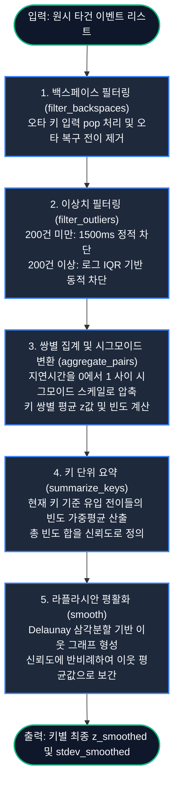

# Spatial Keystroke Dynamics Model (SKDM) 핵심 로직 가이드

이 문서는 Spatial Keystroke Dynamics Model (SKDM) 백엔드 데이터 처리 파이프라인의 핵심 단계를 요약 설명합니다.

---

## 1. 핵심 파이프라인 흐름도 (Mermaid)

아래 다이어그램은 데이터 입력부터 최종 평활화된 결과값이 도출되기까지의 단방향 흐름을 나타냅니다.

---

## 2. 핵심 단계 요약 설명

### 1. 백스페이스 필터링 (`filter_backspaces`)
- **역할**: 입력 스트림을 스택으로 추적하여 오타를 제거합니다.
- **로직**: 백스페이스 키 입력 시 직전 문자를 스택에서 지우고(Pop), 백스페이스 이후의 첫 일반 키 입력(복귀 전이)은 지연시간 계산에서 제외합니다.

### 2. 이상치 필터링 (`filter_outliers`)
- **역할**: 비정상적인 지연(렉, 긴 망설임 등)을 정제합니다.
- **로직**: 200건 미만일 때는 $1500\text{ms}$ 초과를 단순 차단하고, 200건 이상이 쌓이면 로그 변환 후 IQR 임계값($Q_3 + 1.5 \times \text{IQR}$)을 계산하여 동적으로 이상치를 필터링합니다.

### 3. 쌍별 집계 및 시그모이드 변환 (`aggregate_pairs`)
- **역할**: 원시 지연시간(ms) 데이터를 비선형 변환하여 정규화합니다.
- **로직**: 지연시간을 $[0, 1]$ 범위의 시그모이드 값 $z$로 스케일링한 후, 동일 키 쌍(`from_key` ➔ `self_key`) 단위로 평균 $z$값과 관측 빈도(frequency)를 집계합니다.

### 4. 키 단위 가중평균 요약 (`summarize_keys`)
- **역할**: 수많은 쌍별 연결 데이터를 키보드의 각 키 단위 대표값으로 압축합니다.
- **로직**: 특정 키로 들어오는 모든 전이 값들을 해당 쌍의 빈도수(weight)로 가중 평균하여 단일 대표값 $z$를 산출합니다. 키로 유입된 총 빈도수를 해당 키의 신뢰도(Confidence)로 기록합니다.

### 5. 라플라시안 평활화 (`smooth`)
- **역할**: 데이터가 없거나(신뢰도 0) 적은 키의 값을 주변 키들로부터 자연스럽게 전파받아 보간합니다.
- **로직**: 키들의 좌표 평면 위에서 Delaunay 삼각분할을 진행해 인접한 이웃을 정의합니다. 신뢰도가 낮은 키일수록 이웃들의 평균값으로 강하게 당겨오는 라플라시안 평활화 식을 2회 반복 적용합니다.
